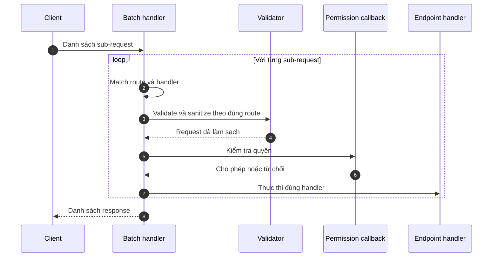
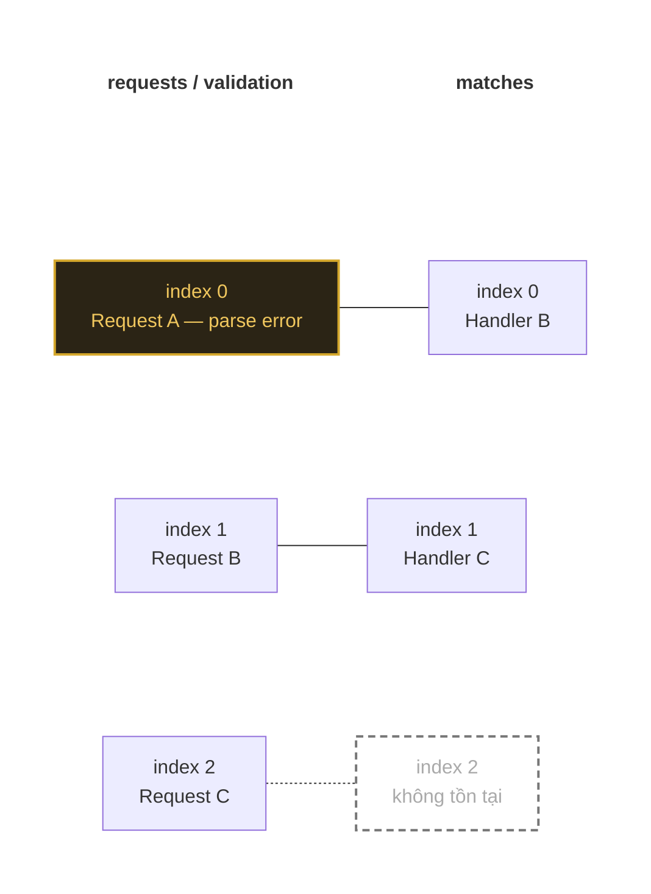
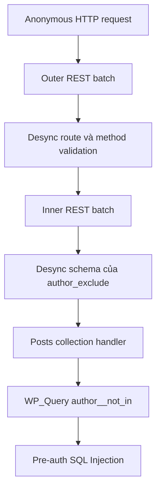
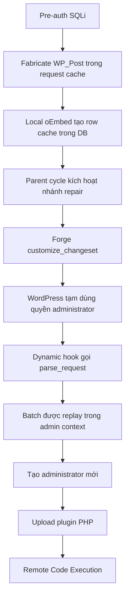

## Lời mở đầu 
Trong giới nghiên cứu bảo mật, việc tìm thấy một lỗ hổng Pre-auth RCE trên WordPress Core mặc định (không phụ thuộc plugin) luôn được coi là lỗi nghiệm trọng rất lớn. Mới đây, chuỗi khai thác wp2shell đã gây xôn xao khi kết hợp hai lỗi tưởng chừng đơn lẻ thành một chuỗi tấn công hoàn chỉnh dẫn đến kết quả RCE nghiêm trọng trên các sản phẩm có sử dụng WordPress.

Trong bài viết này, mình sẽ mổ xẻ source code WordPress Core để xem một lỗi logic trong REST API và một điểm SQLi ẩn mình trong `WP_Query` đã kết hợp với nhau như thế nào.

## Tóm tắt kỹ thuật

`wp2shell` là một exploit chain kết hợp hai lỗi trong WordPress Core:

- **CVE-2026-63030** — lỗi *interpretation conflict* trong REST API Batch khiến kết quả validation của request này có thể bị ghép với handler của request khác.
- **CVE-2026-60137** — SQL Injection tại `author__not_in` của `WP_Query` khi giá trị scalar không được chuẩn hóa thành danh sách số nguyên.

Lỗi thứ nhất làm dữ liệu được validation theo route này nhưng được xử lý bởi handler của route khác; lỗi thứ hai cho phép scalar chưa chuẩn hóa đi vào SQL sink. Trên WordPress **6.9.0–6.9.4** và **7.0.0–7.0.1**, nested batch có thể ghép hai primitive thành SQL injection trước xác thực, sau đó mở rộng thành RCE thông qua cache, oEmbed, Customizer và dynamic hooks. Full chain không cần plugin hoặc tương tác của người dùng trên một cài đặt mặc định.

| Thuộc tính | Đặc điểm kỹ thuật |
| --- | --- |
| Thành phần | WordPress Core |
| Entry point | REST API Batch `/wp-json/batch/v1` |
| Điều kiện full chain | Không cần đăng nhập, không cần plugin, không cần tương tác |
| Phiên bản full chain | 6.9.0–6.9.4; 7.0.0–7.0.1 |
| Bản sửa | 6.9.5; 7.0.2 |
| Tác động cuối | Tạo administrator, sau đó dùng chức năng quản trị để đạt RCE |

Thì để có thể hiểu được chuỗi này, trước hết cần nắm rõ cách REST Batch hoạt động và tại sao CVE-2026-63030 lại phá vỡ tính bất biến giữa validation và handler, và sau đó làm thế nào CVE-2026-60137 cho phép scalar đi thẳng vào SQL sink.
Chúng ta sẽ đi qua từng vấn đề một cách chi tiết để hiểu rõ cơ chế và cách khai thác của chain này.

## Mô hình xử lý đúng của REST Batch

REST Batch nhận nhiều sub-request trong một HTTP request. Mỗi sub-request phải giữ nguyên một **context** gồm:

1. request gốc;
2. route và handler đã match;
3. schema dùng để validate/sanitize;
4. permission callback;
5. endpoint callback.

Luồng đúng có thể mô tả như sau:



Tính bất biến ở đây là:

> `request[i]`, `validation[i]` và `handler[i]` phải luôn nói về cùng một sub-request.

CVE-2026-63030 phá vỡ chính tính bất biến này.

## CVE-2026-63030: lệch index giữa validation và handler
Mảnh ghép đầu tiên nằm ở REST API Batch. Câu hỏi đặt ra là: Làm sao để bắt WordPress thực thi dữ liệu chưa qua kiểm duyệt? Câu trả lời nằm ở sự mất đồng bộ index
### Code trước bản vá

Trong WordPress 6.9.4, `serve_batch_request_v1()` duy trì hai mảng song song là `$matches` và `$validation`. Khi parser tạo ra một `WP_Error`, code chỉ thêm lỗi vào `$validation` rồi `continue`:

```php
if ( is_wp_error( $single_request ) ) {
    $has_error    = true;
    $validation[] = $single_request;
    continue;
}

$match     = $this->match_request_to_handler( $single_request );
$matches[] = $match;
```

Đoạn code có thể kiểm tra trực tiếp trong [WordPress 6.9.4, `class-wp-rest-server.php`](https://github.com/WordPress/wordpress-develop/blob/6.9.4/src/wp-includes/rest-api/class-wp-rest-server.php#L1745-L1758).

Nếu request đầu tiên lỗi:

| Index | `requests` | `validation` | `matches` |
| --- | --- | --- | --- |
| 0 | Request A lỗi | Lỗi của A | Handler của B |
| 1 | Request B hợp lệ | Validation của B | Handler của C |
| 2 | Request C hợp lệ | Validation của C | Không tồn tại |

Vòng thực thi thứ hai bỏ qua A vì nó là lỗi. Tại index 1, WordPress lấy **request B + validation B**, nhưng lại dùng **handler C**. Dữ liệu đã được kiểm tra theo schema của một route có thể được thực thi trong route khác.



> Có thể  tưởng tượng như khi xếp hàng khám bệnh: Y tá phát phiếu kiểm tra cho 3 người A, B, C. Người A bị thiếu hồ sơ nên bị loại ra, nhưng y tá lại quên không rút số thứ tự của A ra khỏi danh sách chờ gặp Bác sĩ. Kết quả là Bác sĩ lấy hồ sơ khám của bệnh nhân B nhưng lại áp dụng đơn thuốc/quy trình cho bệnh nhân C.

Đây không đơn thuần là “quên permission check”. Permission callback vẫn chạy, nhưng nó chạy trong **ngữ cảnh đã bị ghép sai**.

### Bản vá 

WordPress 6.9.5 thêm đúng một phần tử vào `$matches` ở nhánh lỗi:

```diff
if ( is_wp_error( $single_request ) ) {
    $has_error = true;
+   $matches[] = $single_request;
    $validation[] = $single_request;
    continue;
}
```

Xem [source sau bản vá](https://github.com/WordPress/wordpress-develop/blob/6.9.5/src/wp-includes/rest-api/class-wp-rest-server.php#L1751-L1764). Thay đổi này giữ độ dài và index của hai mảng đồng bộ ngay cả khi một request parse thất bại.

Đây là **proof by patch**: bản vá khôi phục đúng tính bất biến mà mình đã phân tích ở trên cho rằng đã bị phá vỡ.

## CVE-2026-60137: scalar đi thẳng vào câu SQL

### Sink trong `WP_Query`

`author__not_in` về mặt thiết kế là một mảng author ID. Code WordPress 6.9.4 chỉ gọi `absint()` khi input thật sự là array:

```php
if ( ! empty( $query_vars['author__not_in'] ) ) {
    // BƯỚC 1: Chỉ kiểm tra và làm sạch NẾU NÓ LÀ MẢNG (ARRAY)
    if ( is_array( $query_vars['author__not_in'] ) ) {
        $query_vars['author__not_in'] =
            array_map( 'absint', $query_vars['author__not_in'] );
    }
    // BƯỚC 2: Ép kiểu thành mảng và nối chuỗi
    $ids = implode( ',', (array) $query_vars['author__not_in'] );
    // BƯỚC 3: Ghép trực tiếp vào câu lệnh SQL (Sink)
    $where .= " AND posts.post_author NOT IN ($ids) ";
}
```

Nếu giá trị là scalar string, nhánh ép kiểu bị bỏ qua. Cast `(array)` chỉ biến string thành mảng chứa chính string đó; nó không biến nội dung thành số. Sau `implode()`, dữ liệu vẫn được nối vào SQL.

> Lấy 1 ví dụ nhỏ để dễ  hình dung, hãy tưởng tượng trạm kiểm soát an ninh sân bay có quy định:
- Nếu hành khách mang Một chiếc vali (Array): Bảo vệ sẽ bắt mở vali ra và soi X-ray từng món đồ (absint - lọc sạch mọi thứ nguy hiểm, chỉ giữ lại số nguyên)
- Nếu hành khách chỉ cầm Một món đồ lẻ trên tay (Scalar String): Bảo vệ nghĩ "Ồ, đây không phải vali!", nên bỏ qua bước soi X-ray, nhét món đồ đó vào một chiếc túi ni-lông (array) rồi cho đi thẳng lên máy bay (nối thẳng vào câu lệnh SQL).
Chính sơ hở này đã cho phép món đồ nguy hiểm (mã độc SQL) lọt qua kiểm duyệt!

Kịch bản 1: Đúng như lập trình viên mong đợi (Truyền Mảng)
- Đầu vào (Input): `author__not_in = [1, 2, "3' OR 1=1"]`
- Xử lý:
    1. `is_array()` trả về  `TRUE`.
    2. `array_map('absint', ...)` hoạt động: Chuỗi `"3' OR 1=1"` bị ép thành số integer `3`.
    3. `$ids` trở thành `"1,2,3"`.
    4. Câu SQL thu được: `AND posts.post_author NOT IN (1,2,3)` $\rightarrow$ An toàn!
Kịch bản 2: Kẻ tấn công lợi dụng lỗ hổng (Truyền Chuỗi / Scalar String)
- Đầu vào (Input): `author__not_in = "1) UNION SELECT ... --"` (chuỗi ký tự, không phải mảng)
- Xử lý:
    1. `is_array()` trả về  `FALSE` $\rightarrow$ Bỏ qua toàn bộ bước làm sạch `absint`!
    2. Ép kiểu `(array) "1) UNION SELECT ... --"` biến chuỗi này thành một mảng chứa 1 phần tử: `["1) UNION SELECT ... --"]`.
    3. `implode()` nối mảng ra lại đúng chuỗi độc hại ban đầu: `"1) UNION SELECT ... --"`.
    4. Ghép thẳng vào SQL:
    ```SQL
    AND posts.post_author NOT IN (1) UNION SELECT ... --)
    ```
    - $\rightarrow$ SQL Injection thành công!

Source gốc nằm tại [`class-wp-query.php` của WordPress 6.9.4](https://github.com/WordPress/wordpress-develop/blob/6.9.4/src/wp-includes/class-wp-query.php#L2403-L2410).

### Vì sao REST API bình thường chưa khai thác được lỗi này?

Nếu đứng một mình, lỗi trong `WP_Query` chưa đủ để tạo SQL injection trước xác thực qua REST API mặc định của WordPress. Khi một request đi vào endpoint như `/wp-json/wp/v2/posts`, REST Posts Controller đóng vai trò lớp gác cửa: tham số `author_exclude` bắt buộc phải là **mảng số nguyên**, sau đó từng phần tử được kiểm tra và làm sạch trước khi chuyển xuống `WP_Query`.

```text
author_exclude
    → validate kiểu array
    → sanitize từng integer
    → map sang author__not_in
    → WP_Query
```

Vì vậy attacker không thể gửi một scalar string độc hại thẳng từ REST API vào `author__not_in` trong luồng bình thường. CVE-2026-60137 được gọi là *facilitated SQL injection* vì nó cần một caller khác phá vỡ contract dữ liệu — chẳng hạn plugin hoặc theme chuyển input không tin cậy trực tiếp vào `WP_Query`.

Điểm mấu chốt ở đây:
Nhờ có CVE-2026-63030 (lỗi lệch index mảng trong REST API Batch ở đoạn trên), ta mới **đánh tráo** được luồng kiểm duyệt: làm cho bộ gác cửa REST API kiểm tra dữ liệu của đường dẫn A, nhưng lại chuyển dữ liệu chưa lọc đó cho đường dẫn B xử lý $\rightarrow$ Dữ liệu chuỗi độc hại lọt thẳng xuống điểm chết trong WP_Query.


### Bản vá tại sink

WordPress 6.9.5 không còn phân nhánh theo kiểu input. Mọi giá trị đều được đưa qua `wp_parse_id_list()`:

```php
$author_ids = wp_parse_id_list( $query_vars['author__not_in'] );

if ( count( $author_ids ) > 0 ) {
    sort( $author_ids );
    $where .= sprintf(
        " AND posts.post_author NOT IN (%s) ",
        implode( ',', $author_ids )
    );
}
```

Xem [source WordPress 6.9.5](https://github.com/WordPress/wordpress-develop/blob/6.9.5/src/wp-includes/class-wp-query.php#L2403-L2413). Đây là defense-in-depth hợp lý: kể cả caller vi phạm contract và truyền scalar, sink vẫn chỉ nhận danh sách ID đã chuẩn hóa.

## Hai lỗi nối thành pre-auth SQLi ra sao?

Đến đây chắc hẳn mọi người cũng có thể tưởng tượng ra cách CVE-2026-63030 và CVE-2026-60137 kết hợp với nhau: route confusion làm lệch validation, rồi Posts handler nhận một scalar chưa chuẩn hóa, và cuối cùng SQLi xảy ra.

Batch API không cho phép mọi method ở mọi tầng. Nhóm nghiên cứu cho thấy một batch lồng nhau có thể tận dụng route confusion hai lần:

1. tầng ngoài làm lệch validation của trường method;
2. tầng trong làm lệch validation của `author_exclude`;
3. Posts handler cuối cùng nhận một scalar thay vì mảng integer;
4. `WP_Query` ghép scalar đó vào `NOT IN (...)`.



Sơ đồ trên cố ý dừng ở primitive và không biểu diễn payload. Điều cần chứng minh là **input đã được kiểm tra ở context A nhưng được tiêu thụ ở context B**, rồi đi vào một sink không tự bảo vệ.

## Từ SQLi chỉ đọc đến RCE

SQLi này không tự động ghi tùy ý vào database. Phần sáng tạo nhất của wp2shell là biến một primitive đọc/fabricate row thành thay đổi trạng thái WordPress.

Ta sẽ thấy chuỗi hậu khai thác gồm các gadget sau:

1. **`WP_Post` trong cache:** UNION-based SQLi tạo các hàng post giả trong cache của request.
2. **oEmbed cache:** local embed khiến WordPress tạo các row `oembed_cache` thật trong `wp_posts`.
3. **Cache reconciliation:** cùng một post ID có bản trong database và bản giả trong memory; WordPress cố đồng bộ chúng.
4. **Cycle repair:** một quan hệ parent tạo chu trình buộc WordPress gọi `wp_update_post()` theo nhánh không ghi đè `post_content`.
5. **`customize_changeset`:** post giả được diễn giải thành changeset mang `user_id` của administrator; WordPress tạm đặt current user theo ID này để áp dụng thay đổi.
6. **Dynamic hook:** status và post type giả tạo tên hook `parse_request`, khiến request pipeline được chạy lại khi context administrator vẫn còn hiệu lực.
7. **Privilege escalation:** sub-request tạo administrator vốn thất bại ở lượt guest sẽ thành công ở lượt replay.
8. **RCE:** tài khoản administrator mới dùng chức năng upload plugin để đưa PHP lên máy chủ.



Chuỗi này giải thích chính xác vì sao “SQLi đọc” vẫn có thể thành RCE: kẻ tấn công không cần một câu `UPDATE` trực tiếp. Họ lợi dụng cache, oEmbed, Customizer và hook system để WordPress tự thực hiện các lần ghi hợp lệ.

## Phạm vi ảnh hưởng: cần tách full chain và SQLi riêng lẻ

| Phiên bản | Trạng thái |
| --- | --- |
| Trước 6.8 | Không bị ảnh hưởng bởi hai CVE này theo release note |
| 6.8.0–6.8.5 | Có CVE-2026-60137; không có full route-confusion chain |
| 6.8.6+ | Đã vá SQLi của nhánh 6.8 |
| 6.9.0–6.9.4 | Bị ảnh hưởng bởi full wp2shell chain |
| 6.9.5+ | Đã vá cả hai primitive của nhánh 6.9 |
| 7.0.0–7.0.1 | Bị ảnh hưởng bởi full wp2shell chain |
| 7.0.2+ | Đã vá cả hai primitive của nhánh 7.0 |

Hai câu tưởng mâu thuẫn thực ra đang nói về hai phạm vi khác nhau:

- “`<= 6.8.5` không bị wp2shell” — đúng khi nói về **full pre-auth RCE chain**.
- “6.8.0–6.8.5 có CVE-2026-60137” — đúng khi nói về **sink SQLi riêng lẻ**.

## Bài học thiết kế

wp2shell hình thành vì nhiều lớp đều tin rằng lớp trước đã giữ đúng contract:

- REST handler tin schema validation đã chạy cho chính route của mình.
- `WP_Query` tin `author__not_in` luôn là danh sách ID.
- cache tin object cùng ID đại diện cùng một post hợp lệ.
- Customizer tin `user_id` trong changeset đến từ row hợp lệ.
- hook dispatcher tin status và post type đã được chuẩn hóa.

Không lớp nào một mình “tạo RCE”. RCE xuất hiện khi các trust boundary này được nối lại theo một đường mà kiến trúc sư không dự kiến.

## Kết luận

Bằng chứng từ source và patch cho phép kết luận rõ:

1. CVE-2026-63030 làm `$matches` và `$validation` lệch index.
2. CVE-2026-60137 để scalar `author__not_in` đi vào SQL.
3. Nested batch nối route confusion tới SQLi trước xác thực.
4. Cache, oEmbed, changeset, cycle repair và dynamic hook biến primitive đọc thành administrator context.
5. Tài khoản administrator mới mở đường tới plugin upload và RCE.

Về mặt thiết kế, bài học lớn nhất là validation chỉ có ý nghĩa khi nó được gắn không thể tách rời với đúng object và đúng handler sẽ tiêu thụ dữ liệu.

## Tài liệu tham khảo

- [WordPress 7.0.2 Security Release](https://wordpress.org/news/2026/07/wordpress-7-0-2-release/)
- [GHSA-ff9f-jf42-662q / CVE-2026-63030](https://github.com/WordPress/wordpress-develop/security/advisories/GHSA-ff9f-jf42-662q)
- [GHSA-fpp7-x2x2-2mjf / CVE-2026-60137](https://github.com/WordPress/wordpress-develop/security/advisories/GHSA-fpp7-x2x2-2mjf)
- [CVE Record: CVE-2026-63030](https://www.cve.org/CVERecord?id=CVE-2026-63030)
- [CVE Record: CVE-2026-60137](https://www.cve.org/CVERecord?id=CVE-2026-60137)
- [Searchlight Cyber: technical wp2shell chain](https://slcyber.io/research-center/exploit-brokers-pay-500000-for-a-wordpress-rce-i-found-one-with-gpt5-6/)
