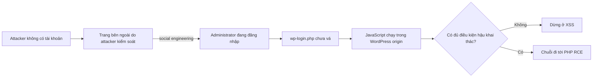
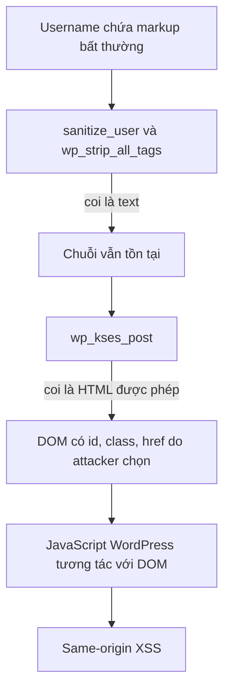
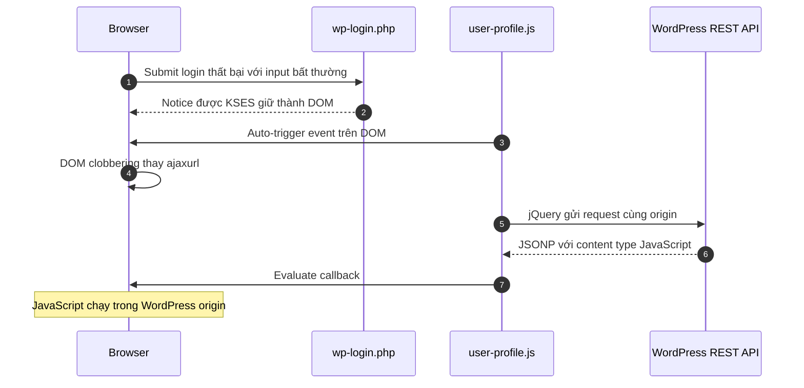
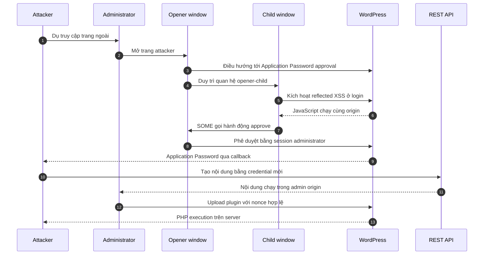

## Tóm tắt kỹ thuật

**CVE-2026-64638** bắt đầu từ một HTML sink nhỏ trên `wp-login.php`: username không tồn tại được đưa vào thông báo lỗi mà chưa qua `esc_html()`. Tác động của lỗi được khuếch đại bởi sự khác biệt giữa các parser, JavaScript `user-profile` chạy trong login context, DOM clobbering và REST JSONP.

Với session administrator và chuỗi Same Origin Method Execution (SOME) phù hợp, reflected XSS có thể được mở rộng thành Application Password compromise và cuối cùng là PHP RCE. Chuỗi do [pwn.ai](https://pwn.ai/blog/xss2shell) công bố cho thấy browser của administrator trở thành cầu nối giữa một lỗi output encoding và khả năng thực thi code phía server.

| Thuộc tính | Đặc điểm kỹ thuật |
| --- | --- |
| Định danh | CVE-2026-64638 / GHSA-52p2-r8wf-jcrf |
| CWE | CWE-79 — Reflected Cross-Site Scripting |
| Thành phần | WordPress Core, màn hình đăng nhập |
| Điểm bắt đầu | Không cần tài khoản WordPress |
| Điều kiện lên RCE | Social engineering, nạn nhân tương tác và có phiên administrator |
| Bản vá chính | WordPress 7.0.3 |
| Backport | Các nhánh nhận security fix xuống tới 4.7 |

## Phương pháp và nguồn bằng chứng

Phân tích dựa trên bốn lớp bằng chứng:

| Luận điểm | Bằng chứng |
| --- | --- |
| Phạm vi và điều kiện khai thác | [CVE Record CVE-2026-64638](https://www.cve.org/CVERecord?id=CVE-2026-64638) |
| Phiên bản vá và backport | [WordPress 7.0.3 Security Release](https://wordpress.org/news/2026/08/wordpress-7-0-3-release/) |
| Root cause và hiệu lực bản vá | Diff `user.php` giữa WordPress 7.0.2 và 7.0.3 |
| Chuỗi XSS → RCE | [Bài công bố kỹ thuật của pwn.ai](https://pwn.ai/blog/xss2shell) |

Ta sẽ tách ba câu hỏi:

1. **Source hay sink nào tạo ra XSS?**
2. **Vì sao markup sống sót qua các lớp làm sạch?**
3. **Điều kiện nào biến JavaScript trên trình duyệt thành PHP execution trên server?**

## Threat model: ai phải làm gì?

| Actor | Điều kiện |
| --- | --- |
| Attacker | Không cần tài khoản trên WordPress đích; kiểm soát một trang bên ngoài |
| Nạn nhân | Truy cập hoặc tương tác với trang của attacker |
| Phiên đăng nhập | Để đạt full RCE, nạn nhân cần đang đăng nhập bằng tài khoản có quyền mạnh |
| WordPress | Chạy phiên bản chưa vá và các tính năng cần cho chuỗi hậu khai thác |

Điểm vào XSS không yêu cầu tài khoản, trong khi full RCE phụ thuộc vào tương tác của nạn nhân và một phiên administrator đang hoạt động. Vì vậy có hai mốc tác động khác nhau:

- **XSS primitive:** bắt đầu trước xác thực tại trang login.
- **RCE chain:** có điều kiện, phụ thuộc vào quyền và hành vi của nạn nhân.



## Root cause: username được render mà chưa escape

### Source và sink

Khi đăng nhập bằng username không tồn tại, `wp_authenticate_username_password()` tạo một `WP_Error`. Trong WordPress 7.0.2, giá trị `$username` được đưa thẳng vào chuỗi HTML:

```php
return new WP_Error(
    'invalid_username',
    sprintf(
        __( 'The username <strong>%s</strong> is not registered.' ),
        $username
    )
);
```

Source có thể kiểm tra tại [`user.php` của WordPress 7.0.2](https://github.com/WordPress/wordpress-develop/blob/7.0.2/src/wp-includes/user.php#L181-L191).

`sanitize_user()` đã chạy trước đó, nhưng tên hàm dễ gây hiểu nhầm. Sanitization ở đây nhằm chuẩn hóa username, không phải bảo đảm dữ liệu an toàn cho mọi output context. Khi output nằm trong HTML, primitive đúng phải là **HTML escaping**.

### Proof by patch

WordPress 7.0.3 chỉ thay đối số cuối thành:

```diff
- $username
+ esc_html( $username )
```

Xem [source sau bản vá](https://github.com/WordPress/wordpress-develop/blob/7.0.3/src/wp-includes/user.php#L181-L191).

`esc_html()` biến các ký tự có ý nghĩa cú pháp thành text trước khi chúng chạm KSES hoặc browser. DOM attacker muốn tạo không còn hình thành. Đây là bằng chứng trực tiếp rằng sink chưa escape là root cause, còn các gadget JavaScript phía sau chỉ là chuỗi khuếch đại tác động.

## Parser differential: cùng input, ba cách hiểu

### Lớp 1 — `wp_strip_all_tags()`

`wp_strip_all_tags()` dựa trên `strip_tags()` của PHP. Theo phân tích của pwn.ai, một dạng cú pháp mở thẻ có khoảng trắng ở vị trí bất thường không được parser này nhận diện là tag, nên chuỗi vẫn sống sót như text.

### Lớp 2 — KSES

Thông báo lỗi sau đó đi qua cơ chế notice và `wp_kses_post()`. KSES có tokenizer riêng và diễn giải cùng chuỗi là HTML. Một số element cùng thuộc tính `id`, `class` và `href` nằm trong allowlist nên được giữ lại.

### Lớp 3 — trình duyệt

Browser parse output cuối cùng và tạo các node DOM thật. Không cần đưa `<script>` qua filter; chỉ cần tạo đúng DOM để JavaScript có sẵn của WordPress tự tương tác.



Đây là **parser differential**: bảo mật thất bại không phải vì hoàn toàn không có filter, mà vì các filter không thống nhất về grammar.

## Gadget phía client: `user-profile.js`

### Vì sao script hồ sơ chạy trên trang login?

`wp-login.php` phục vụ cả đăng nhập và reset password. Script `user-profile` cần thiết cho password generator, nhưng ở phiên bản bị ảnh hưởng nó cũng được enqueue trong action login thông thường.

Source WordPress 7.0.2 cho thấy:

```php
wp_enqueue_script( 'user-profile' );
```

Script này được viết với giả định rằng các element của trang profile tồn tại. Trên trang login bình thường chúng không tồn tại, nhưng attacker vừa có khả năng tạo DOM mang selector phù hợp.

### Hai giả định ghép thành auto-trigger

Theo pwn.ai, `user-profile.js` có hai hành vi đáng chú ý:

1. một ready handler tự kích hoạt click trên button password generator;
2. delegated click handler đọc hai input ID và so sánh chúng trước khi gửi `$.post(ajaxurl, ...)`.

Trên trang login, cả hai input đều vắng mặt. jQuery trả về `undefined` cho cả hai:

```javascript
undefined === undefined // true
```

Guard vì thế vượt qua không phải do attacker biết ID, mà vì code không phân biệt “hai giá trị bằng nhau” với “hai element đều không tồn tại”.

## DOM clobbering biến element thành URL

`ajaxurl` thường được WordPress định nghĩa trên trang admin, nhưng không được định nghĩa trong login context. HTML named properties cho phép element có `id` phù hợp xuất hiện như thuộc tính của `window`.

Khi code tham chiếu biến global chưa tồn tại, browser có thể trả về element do attacker tạo. Nếu element này có semantics của hyperlink, ép kiểu sang string cho ra `href`. Kết quả:

```text
ajaxurl đáng lẽ là URL do WordPress định nghĩa
        ↓
window.ajaxurl bị DOM clobbering
        ↓
jQuery POST tới URL do attacker sắp xếp trong cùng origin
```

Đến đây vẫn chưa có JavaScript attacker trực tiếp. Primitive tiếp theo đến từ REST JSONP.

## REST JSONP và jQuery hoàn thành XSS

WordPress REST API hỗ trợ JSONP callback. Response được trả với content type JavaScript. jQuery `$.post()` không được chỉ định data type nên suy luận từ response header và đánh giá body như script.

Chuỗi ở mức cơ chế:

1. DOM clobbering điều hướng request tới REST API;
2. REST API bọc JSON trong callback hợp lệ;
3. response mang `Content-Type: application/javascript`;
4. jQuery chọn script converter và evaluate response;
5. callback chạy trong origin WordPress.



Như vậy, “XSS” đã được chứng minh mà không cần dựa vào việc thẻ script vượt filter.

## Từ XSS tới RCE

JavaScript cùng origin có quyền rất mạnh nếu browser đang giữ session administrator. Tuy nhiên, chuỗi cần giải quyết nonce, capability check và browser isolation. pwn.ai sử dụng kỹ thuật **Same Origin Method Execution (SOME)** cùng quan hệ `window.opener`.

### Chuỗi được công bố

1. Trang attacker tạo quan hệ giữa hai browser window.
2. Window chính được điều hướng tới trang phê duyệt Application Password của WordPress.
3. Window con kích hoạt XSS trên `wp-login.php`.
4. JSONP callback dùng property chain để gọi phương thức click của nút phê duyệt ở opener.
5. WordPress xử lý click bằng session, capability và nonce thật của administrator.
6. Application Password mới được trả về success URL đã đăng ký.
7. Credential API này được dùng để tạo nội dung có JavaScript bằng REST API.
8. Khi nội dung chạy trong phiên administrator, script lấy nonce upload plugin và gửi plugin ZIP.
9. PHP trong thư mục plugin được web server thực thi, tạo RCE.



### Điều kiện nào có thể phá full chain?

| Điều kiện | Ảnh hưởng |
| --- | --- |
| Nạn nhân không đăng nhập | Không có administrator session để mượn |
| Tài khoản không đủ capability | Không thể thực hiện các bước quản trị mạnh |
| Application Passwords bị vô hiệu hóa | Mất mắt xích cấp credential API |
| `DISALLOW_FILE_MODS` hoặc policy cấm upload plugin | Khó đi từ admin browser tới PHP file |
| Browser chặn popup hoặc quan hệ opener thay đổi | Có thể phá kỹ thuật SOME cụ thể |

Các điều kiện này giải thích vì sao CVE record ghi “conditions outside of the attacker's control”. Chúng là mitigating factors, không phải bản vá cho XSS gốc.

## Phạm vi phiên bản và bản vá

[GHSA-52p2-r8wf-jcrf](https://github.com/WordPress/wordpress-develop/security/advisories/GHSA-52p2-r8wf-jcrf) liệt kê các point release đã vá:

| Nhánh | Bản vá |
| --- | --- |
| 7.0 | **7.0.3** |
| 6.9 | **6.9.6** |
| 6.8 | **6.8.7** |
| 6.7 | **6.7.6** |
| 6.6 | **6.6.6** |
| 6.5 | **6.5.9** |
| 6.4 | **6.4.9** |
| 6.3 | **6.3.9** |
| 6.2 | **6.2.10** |
| 6.1 | **6.1.11** |
| 6.0 | **6.0.13** |

Nhánh 5.x và 4.7–4.9 có backport riêng trong advisory. WordPress mô tả đây là courtesy backport và chỉ phiên bản mới nhất được hỗ trợ tích cực.

## Bài học thiết kế

CVE-2026-64638 là một chuỗi các assumption failure:

1. `sanitize_user()` bị hiểu nhầm là an toàn cho HTML output.
2. PHP tag stripping và KSES không dùng cùng grammar.
3. Script profile được chạy ngoài context mà nó được thiết kế.
4. Code coi “hai element đều vắng mặt” là một equality hợp lệ.
5. Global variable có thể bị DOM named property che khuất.
6. JSONP biến dữ liệu thành executable response.
7. Browser của administrator được tin như một control plane.

Các nguyên tắc rút ra:

- escape ở sink theo đúng context;
- không dùng nhiều parser khác grammar trên cùng input nếu thiếu canonicalization;
- kiểm tra element tồn tại trước khi so sánh value;
- tránh implicit global và named property lookup;
- chỉ enqueue script ở đúng action cần thiết;
- loại bỏ JSONP trong thiết kế mới;

## Kết luận

Bằng chứng source cho thấy root cause rất nhỏ: `$username` được đưa vào HTML mà không có `esc_html()`. Nhưng tác động không nhỏ vì output đi qua parser khác, tạo DOM thật, kích hoạt JavaScript sẵn có, clobber global URL và tận dụng REST JSONP để chạy code cùng origin.

XSS trở thành Shell khi browser administrator bị biến thành confused deputy: mọi cookie, nonce và capability đều hợp lệ, nhưng ý định phía sau hành động không còn thuộc về administrator.

## Tài liệu tham khảo

- [WordPress 7.0.3 Security Release](https://wordpress.org/news/2026/08/wordpress-7-0-3-release/)
- [GHSA-52p2-r8wf-jcrf](https://github.com/WordPress/wordpress-develop/security/advisories/GHSA-52p2-r8wf-jcrf)
- [CVE Record: CVE-2026-64638](https://www.cve.org/CVERecord?id=CVE-2026-64638)
- [pwn.ai: XSS2Shell technical research](https://pwn.ai/blog/xss2shell)
- [WordPress 7.0.2 vulnerable source](https://github.com/WordPress/wordpress-develop/blob/7.0.2/src/wp-includes/user.php#L181-L191)
- [WordPress 7.0.3 patched source](https://github.com/WordPress/wordpress-develop/blob/7.0.3/src/wp-includes/user.php#L181-L191)
